# **Skill Assessment**

```
A cybersecurity incident has been announced. Incident Responders have swiftly collected a
malware sample (apple.exe) from the implicated machine. Your responsibility now is to perform
comprehensive analysis of this sample, conducting static, dynamic, and code analysis,in an
effort to unravel as much as possible about the malware's functioning and modus operandi.
```

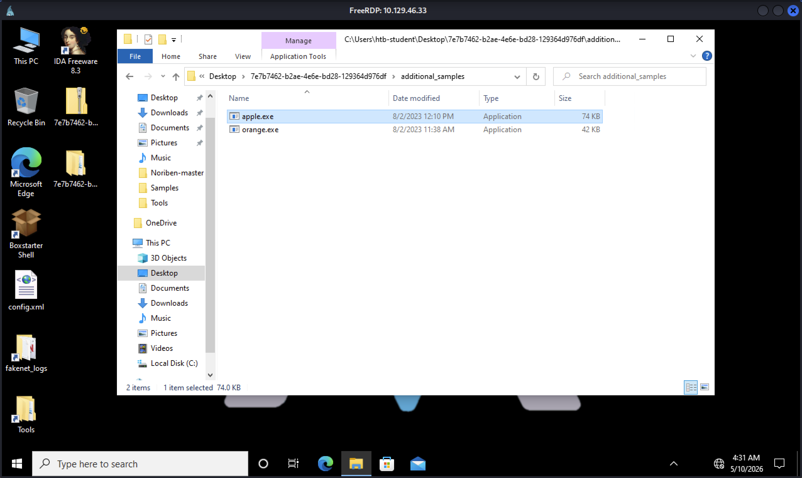

### Enter the MD5 hash of the malware as your answer.

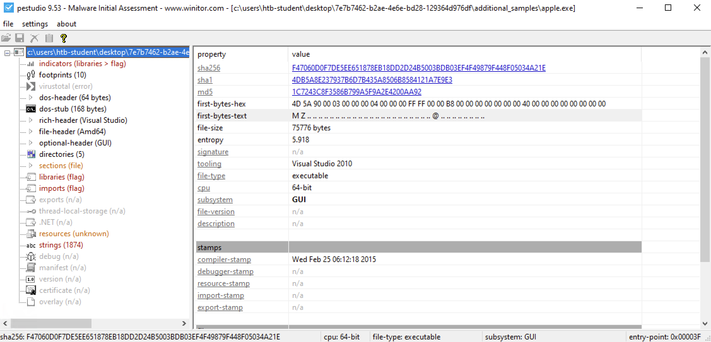

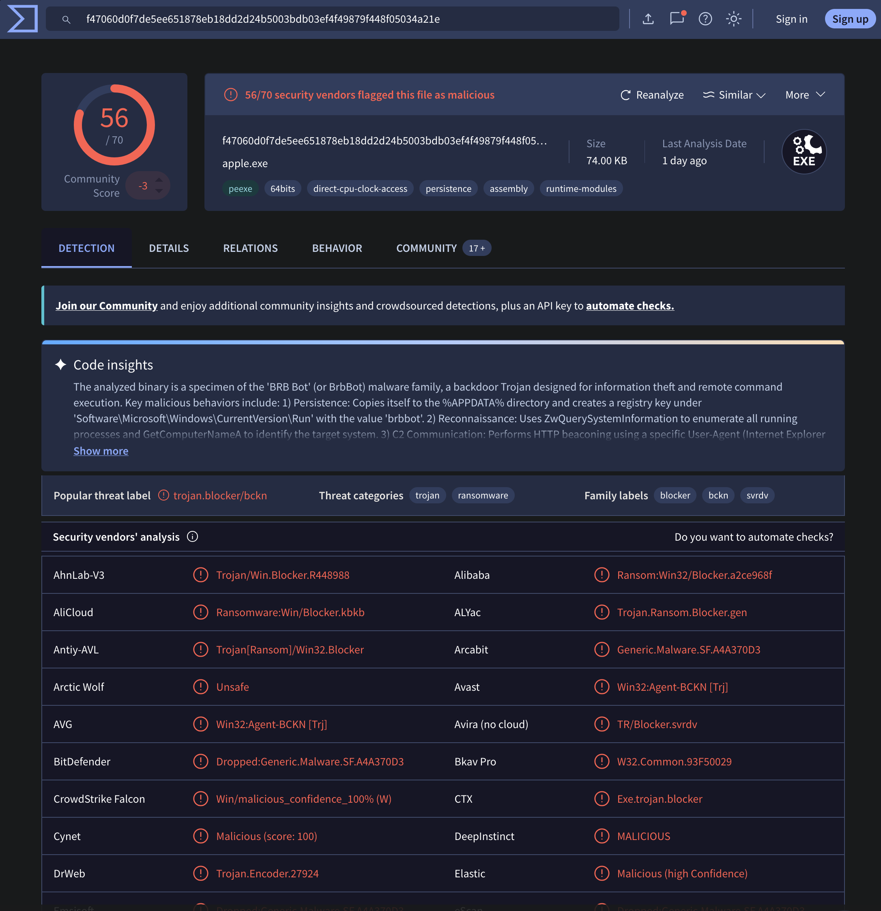

```
1C7243C8F3586B799A5F9A2E4200AA92
```

### Does the malware employ packing techniques? Answer format: Yes/No

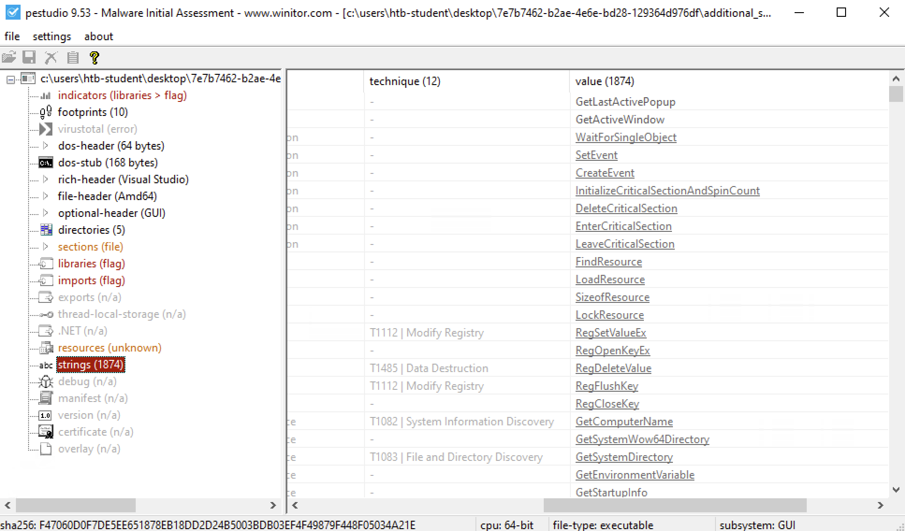

The file contains no traces of UPX strings and there are numerous symbols.

```
No
```

### It appears that the malware is dropping a .tmp file following the infection. Enter the complete name of this .tmp file as your answer.

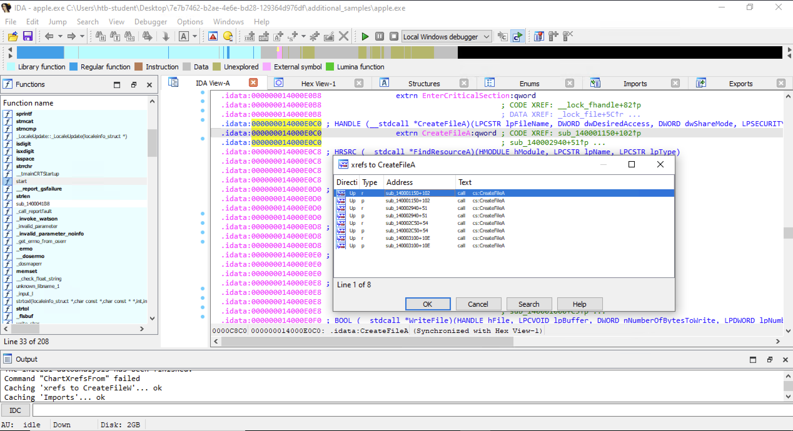

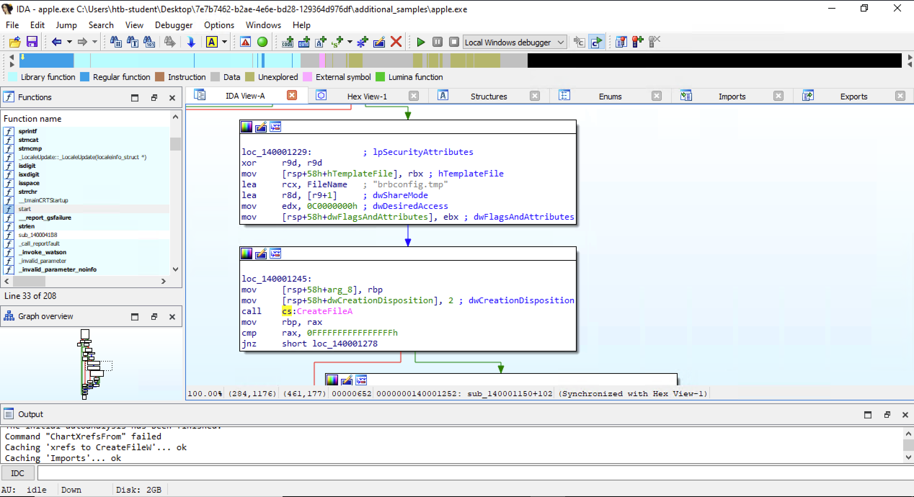

```
brbconfig.tmp
```

### Examine the communication patterns of the malware and provide the domain it interacts with as your answer.

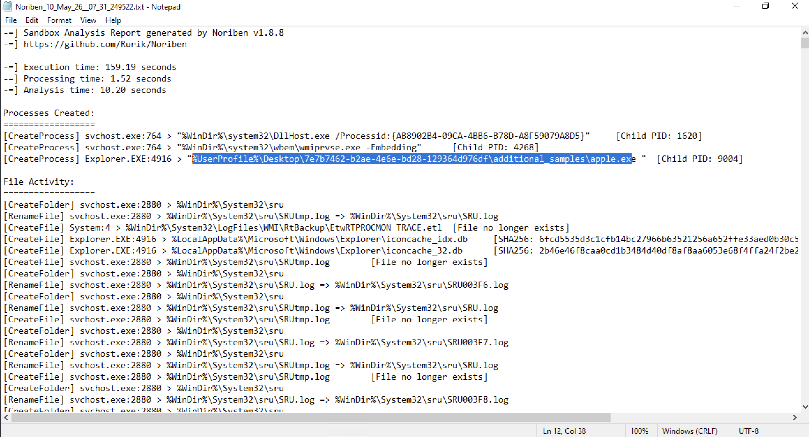

No information about the domain.

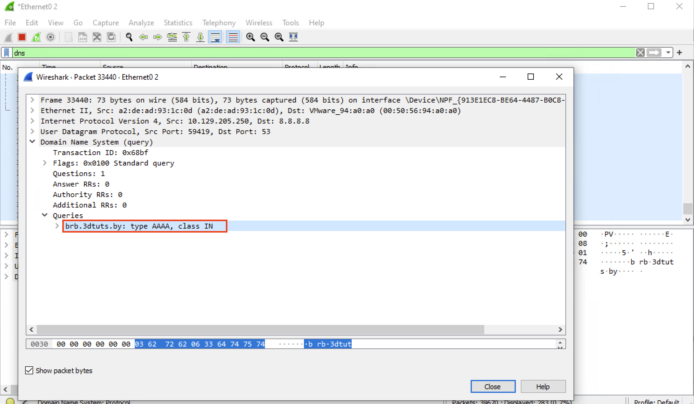

```
brb.3dtuts.by
```

### Does the malware achieve persistence by altering the Software\Microsoft\Windows\CurrentVersion\Run registry key? Answer format: Yes/No

```
.text:00000001400027C0
    wWinMain

        call persistence
        call create_file
        ...

.text:0000000140002803:persistence
    
    call RegOpenKeyExA(
            hKey=0FFFFFFFF80000002h,
            lpSubKey='Software\Microsoft\Windows\CurrentVersion\Run',
            ...
        )
        
    call RegSetValueExA(..., lpValueName=brbbot, ...)

    call RegFlushKey(...)
        
        SUCCESS ->
            call MoveFileExA(
                lpExistingFileName=brbconfig.tmp, 
                lpNewFileName=brbbot, 
                dwFlags=MOVEFILE_DELAY_UNTIL_REBOOT)

        FAIL -> 
            call MoveFileExA(
                lpExistingFileName=brbconfig.tmp, 
                lpNewFileName=0, dwFlags=MOVEFILE_DELAY_UNTIL_REBOOT)

    
.text:0000000140001150:create_file

    call CreateFileA(lpFileName=brbconfig.tmp,...)

    call WriteFile(...)
```

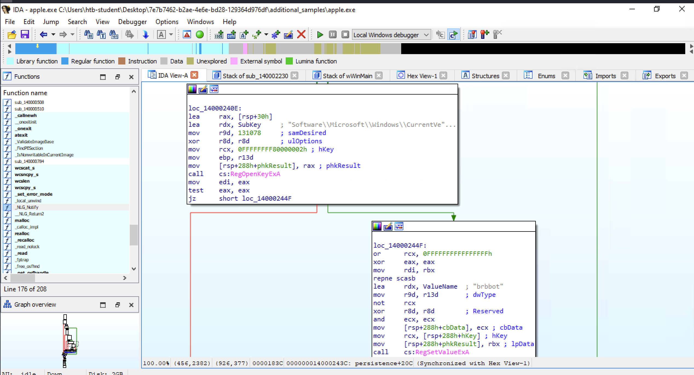

- Persistence with Registry Hives Tampering

```
Yes
```

### After which function in x64dbg should a breakpoint be placed to unveil the decrypted content of the .tmp file?

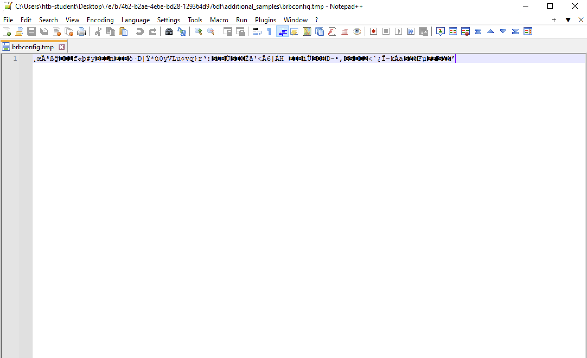

The file "brbconfig.tmp" is encrypted. It is deleted, then the debugger is launched.

There are some cryptography routines in the IAT section.

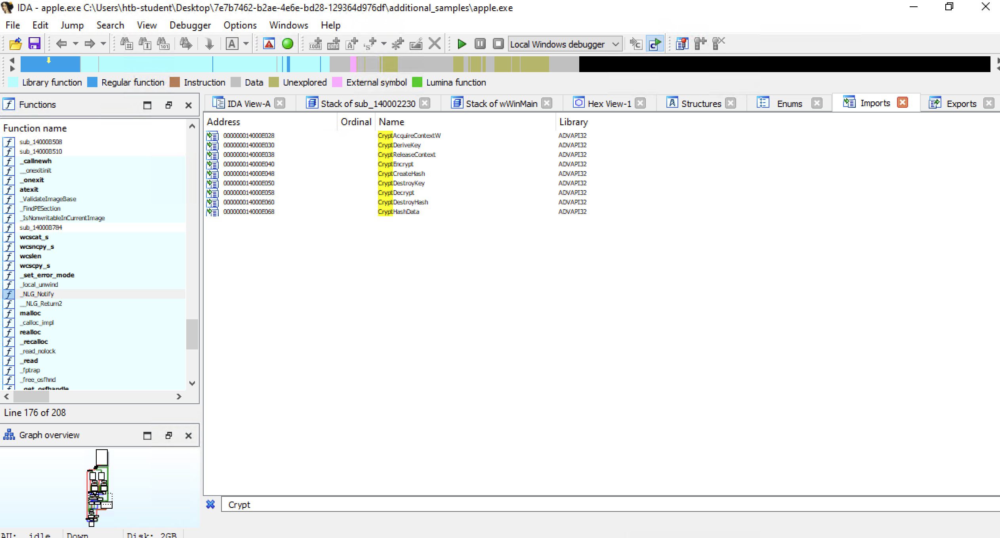

The "CryptDecrypt" is the function of interest.

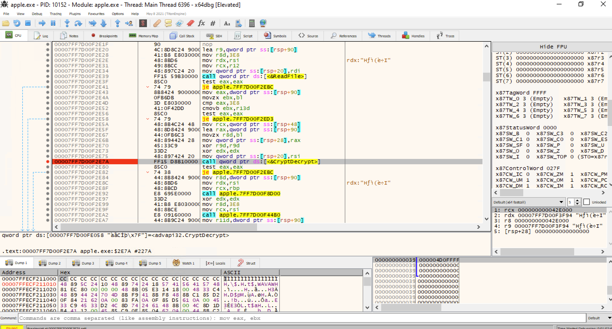

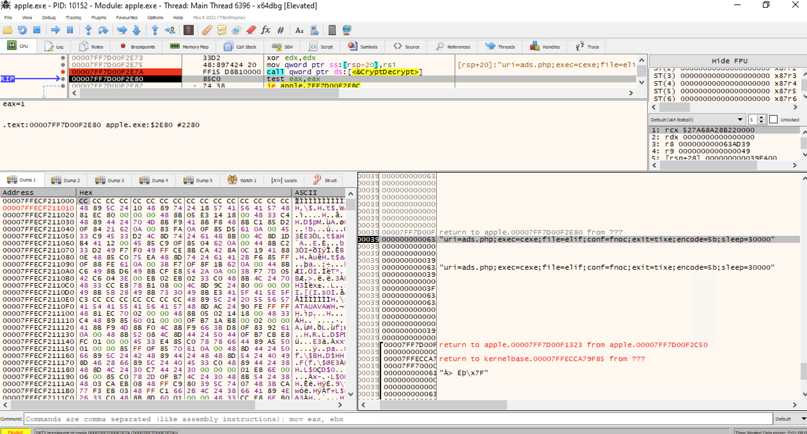

The plaintext of the file dropped by the malware is:

```
uri=ads.php;exec=cexe;file=elif;conf=fnoc;exit=tixe;encode=5b;sleep=30000
```

It can be a network IOC for this malware.

```
CryptDecrypt
```

---
