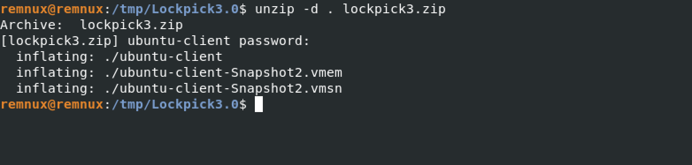
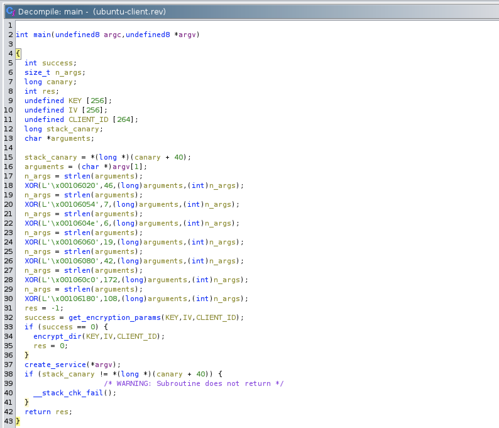
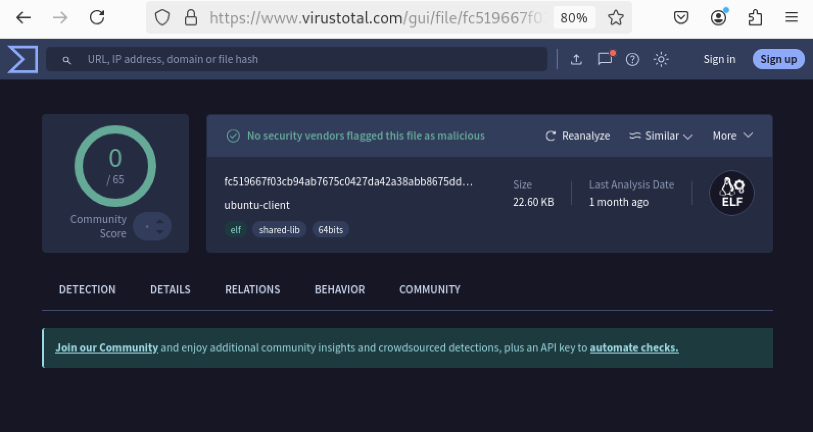
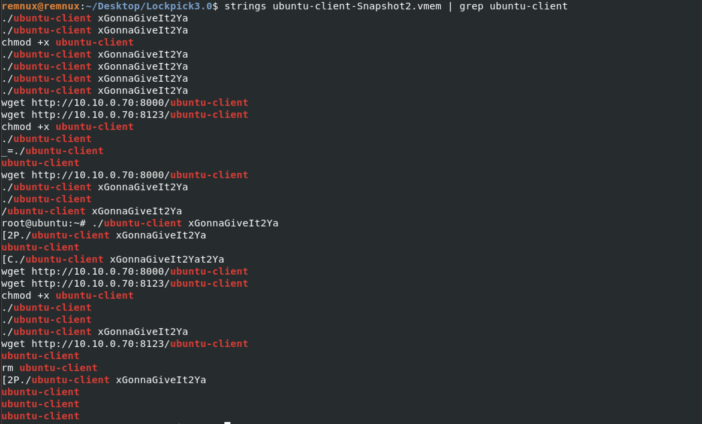
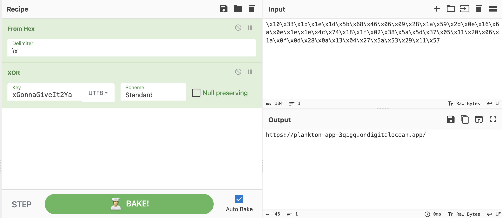
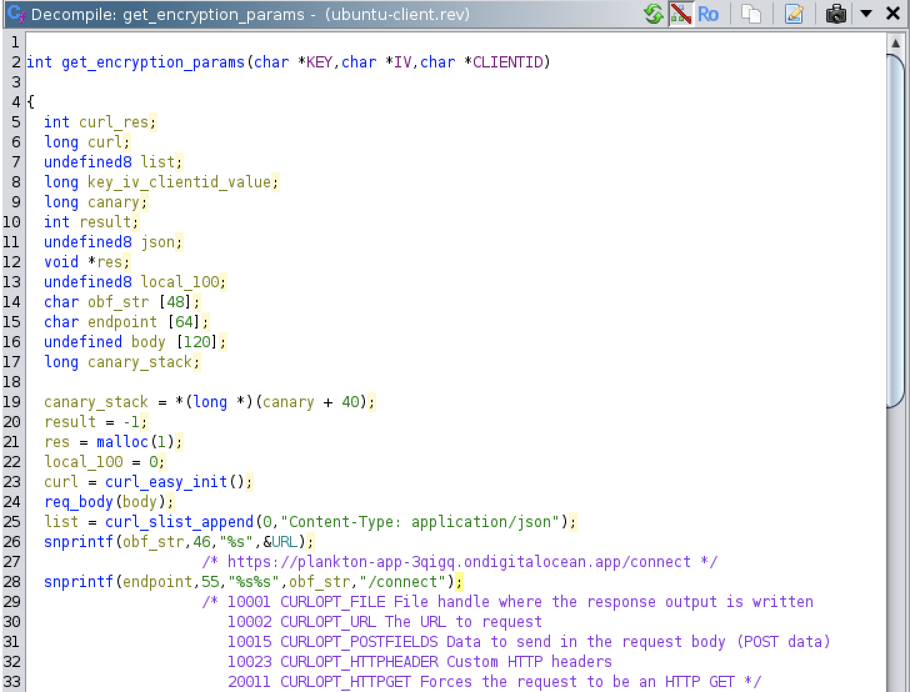
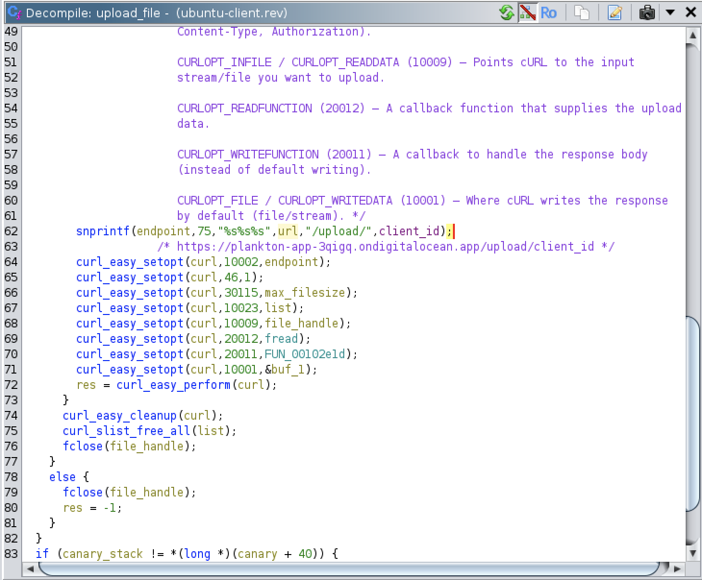
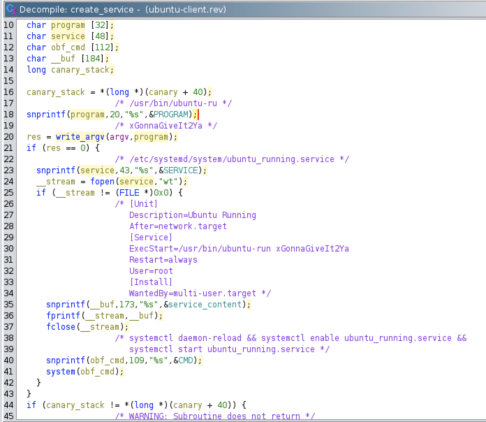
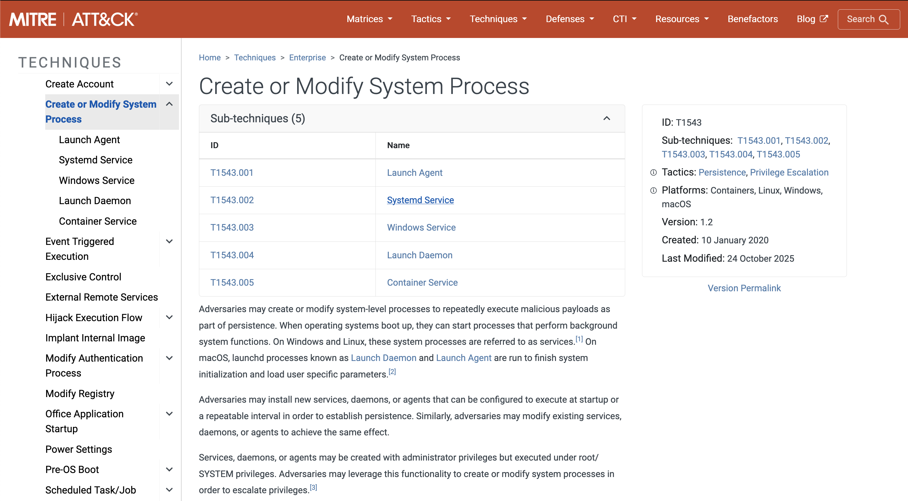
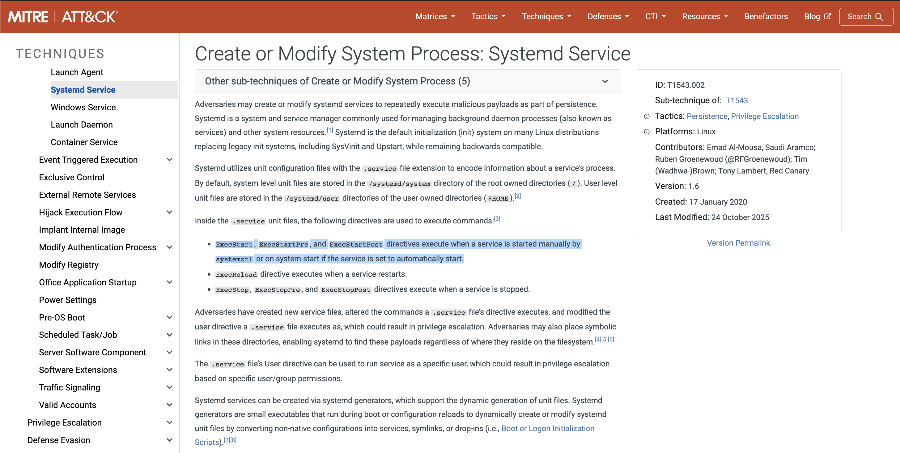

# **Lockpick 3.0**

### Sherlock Scenario

The threat actors of the Lockpick variant of Ransomware seem to have increased their skillset. Thankfully on this occasion they only hit a development, non production server. We require your assistance performing some reverse engineering of the payload in addition to some analysis of some relevant artifacts. Interestingly we can't find evidence of remote access so there is likely an insider threat.... Good luck!

Please note on the day of release this is being utilised for a workshop, however will still be available (and free).



- ubuntu-client: ramsonware
- ubuntu-client-Snapshot2.vmem: VM memory
- ubuntu-client-Snapshot2.vmsn: VM snapshot

```bash
$ file ubuntu-client
```
```
ubuntu-client: ELF 64-bit LSB shared object, x86-64, version 1 (SYSV), dynamically linked, interpreter /lib64/ld-linux-x86-64.so.2, BuildID[sha1]=595b1b2a3a1451774884ddc5d265e25a44e21574, for GNU/Linux 3.2.0, stripped
```

- Stripped
- Dynamically linked

```bash
$ checksec --file ubuntu-client
```
```
[*] '/tmp/Lockpick3.0/ubuntu-client'
    Arch:       amd64-64-little
    RELRO:      Full RELRO
    Stack:      Canary found
    NX:         NX enabled
    PIE:        PIE enabled
    SHSTK:      Enabled
    IBT:        Enabled
```

The malware is statically analyzed with Ghidra.



The strings used in the program are XOR-obfuscated. The decryption key is provided as a command-line argument to the program.

The malware first uploads the contents of files with a specific extension to a remote endpoint.

After the upload, the malware encrypts the files using AES-256 in CBC mode.

The encryption key and initialization vector are retrieved via an HTTPS request to a remote URL.

Finally, the malware creates a service to achieve persistence.

### Please confirm the file hash of the malware? (MD5)

```bash
$ md5sum ubuntu-client
```
```
a2444b61b65be96fc2e65924dee8febd  ubuntu-client
```



```
a2444b61b65be96fc2e65924dee8febd
```

### Please confirm the XOR string utilised by the attacker for obfuscation?



- XOR key: xGonnaGiveIt2Ya

```
xGonnaGiveIt2Ya
```

### What is the API endpoint utilised to retrieve the key?



- URL: **https://plankton-app-3qigq.ondigitalocean.app/**

The full URL at `get_encryption_params`.



```
https://plankton-app-3qigq.ondigitalocean.app/connect
```

### What is the API endpoint utilised for upload of files?

`upload_file`



- URL: **https://plankton-app-3qigq.ondigitalocean.app/upload/CLIENTID**

```
https://plankton-app-3qigq.ondigitalocean.app/upload/
```

### What is the name of the service created by the malware?

`create_service`



```
ubuntu_running.service
```

### What is the technique ID utilised by the attacker for persistence?





```
T1543.002
```

---
